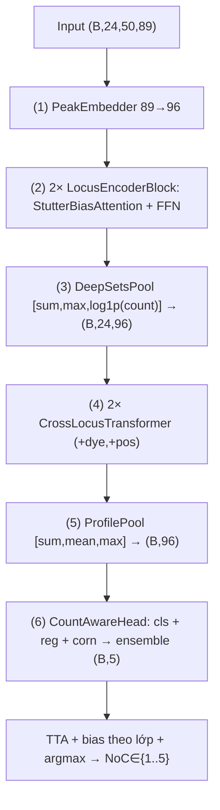

# Ước lượng số người đóng góp trong hỗn hợp DNA pháp y bằng học sâu hoán vị–bất biến: Kiến trúc Deep Sets phân cấp với chú ý lệch theo khoảng allele và đầu đếm đa khung nhìn (NoCNet-v2)

**Tác giả:** Nguyễn Quốc Dung — MSSV 20241586E
**Ngày:** 18/06/2026
**Mã nguồn kèm theo:** `Mã nguồn/` (kiến trúc `models/nocnet_v2/`, tiện ích `src/`, suy luận `predict.py`); trọng số `Mô hình/nocnet_v2_ft.pt` + `bias_tuned.json`; kết quả `Kết quả/`.

---

## Tóm tắt (Abstract)

Xác định **số người đóng góp** (Number of Contributors — NoC) trong một mẫu DNA hỗn hợp là một trong những bài toán khó và quan trọng nhất của di truyền học pháp y, vì NoC là tham số đầu vào *bắt buộc* của hầu hết phần mềm xác suất hóa kiểu gen và một sai sót về NoC sẽ lan truyền thành sai lệch lớn trong tỉ số khả dĩ trình bày trước tòa. Một mẫu hỗn hợp được biểu diễn bằng biểu đồ điện di (electropherogram, EPG) trên các vị trí STR: tại mỗi locus xuất hiện một *tập hợp* các đỉnh allele với chiều cao (RFU) khác nhau, lẫn nhiễu kỹ thuật như stutter, dropout và drop-in. Các phương pháp đếm allele tối đa (Maximum Allele Count — MAC) đánh giá thấp NoC khi allele chồng lấp; các phương pháp xác suất hóa kiểu gen liên tục (EuroForMix, STRmix) mạnh nhưng phải *cố định NoC trước* và tốn kém tính toán.

Trong nghiên cứu này, chúng tôi đề xuất **NoCNet-v2**, một kiến trúc học sâu *hoán vị–bất biến* xem 50 đỉnh tại mỗi locus là một **tập hợp không có thứ tự**. Mô hình gồm bốn ý tưởng cốt lõi: (1) **chú ý lệch theo khoảng allele** (stutter-bias attention) mã hóa quan hệ stutter giữa các đỉnh mà không cần đặc trưng thủ công; (2) **gộp Deep Sets giữ tín hiệu đếm** (`ρ([sum, max, log1p(count)])`) thay cho gộp CLS-softmax vốn làm mất số lượng; (3) một **Transformer xuyên-locus** với nhúng kênh màu và vị trí; và (4) một **đầu đếm đa khung nhìn** kết hợp ba góc nhìn của NoC (phân loại softmax, hồi quy vô hướng, và ordinal CORN) rồi tổ hợp xác suất. Mô hình được tiền huấn luyện trên hỗn hợp in-silico (mô phỏng vật lý) rồi tinh chỉnh trên PROVEDIt thật, kèm SWA, suy luận tăng cường (TTA, MC-dropout 20×) và hiệu chỉnh bias theo lớp.

Trên **phép chia chống rò rỉ theo nhóm phả hệ** (grouped split, seed 42; 2.455 huấn luyện / 923 kiểm thử) của cơ sở dữ liệu PROVEDIt (GlobalFiler/ABI-3500/25 giây), NoCNet-v2 đạt **độ chính xác đếm NoC 0,927** và **macro-F1 0,653**. Đây là con số **trung thực** sau khi chúng tôi phát hiện và loại bỏ một rò rỉ dữ liệu (bể synthetic vô tình chứa profile đơn nguồn của tập kiểm thử) đã từng đẩy kết quả lên 0,943. Kết quả vượt trội đường cơ sở MAC (~0,66) và NoCFormer (0,668) trên cùng phép chia nghiêm ngặt, đồng thời báo cáo trung thực giới hạn ở các lớp NoC cao hiếm gặp.

## Các đóng góp chính của báo cáo (Highlight)

1. **Chú ý lệch theo khoảng allele (stutter-bias attention).** Thay vì nhồi đặc trưng stutter thủ công vào đầu vào, chúng tôi đưa hiệu allele giữa từng cặp đỉnh Δ = allele_j − allele_i qua một MLP học được để sinh *bias cộng* vào logit chú ý. Cơ chế này mã hóa trực tiếp quan hệ stutter (±1, ±2, ±0,2 lần lặp) và giữ tính hoán vị–bất biến của tập đỉnh.

2. **Gộp Deep Sets giữ tín hiệu đếm.** Chúng tôi chỉ ra rằng gộp CLS-softmax (như NoCFormer) làm mất thông tin *số lượng* sau khi chuẩn hóa, trong khi đếm NoC phụ thuộc trực tiếp vào "có bao nhiêu allele tại locus". Bộ gộp Deep Sets `ρ([sum, max, log1p(count)])` bảo toàn cả tổng và *đếm* — cải thiện rõ độ chính xác ở các lớp NoC cao.

3. **Đầu đếm đa khung nhìn (count-aware multi-head).** NoC là nhãn *thứ tự* (ordinal). Chúng tôi đồng huấn luyện ba góc nhìn — phân loại softmax (CE), hồi quy vô hướng (smooth-L1) và ordinal CORN (BCE tích lũy) — rồi tổ hợp xác suất khi suy luận, cho dự đoán ổn định hơn so với mỗi đầu đơn lẻ.

4. **Quy trình dữ liệu chống rò rỉ + tiền huấn luyện in-silico.** Chúng tôi chia tập *theo nhóm phả hệ* (mọi bản sao kỹ thuật của cùng một hỗn hợp nằm cùng một phía) và tiền huấn luyện trên hỗn hợp in-silico mô phỏng vật lý; nhờ đó đo được con số **trung thực 0,927** và minh bạch hóa một rò rỉ dữ liệu đã từng "thổi phồng" kết quả lên 0,943.

## Từ khóa (Keywords)

Phân tích hỗn hợp DNA pháp y; Số người đóng góp (NoC); Deep Sets; Học sâu hoán vị–bất biến; Chú ý lệch theo khoảng allele; Hồi quy thứ tự CORN; Cơ sở dữ liệu PROVEDIt; Rò rỉ dữ liệu

---

## I. Giới thiệu (Introduction)

### I.1. Lĩnh vực và bối cảnh

Giám định DNA là một trụ cột của khoa học hình sự hiện đại. Trong điều tra, các mẫu sinh học thu được tại hiện trường (máu, tế bào biểu mô, lông tóc…) thường không thuần khiết mà là **hỗn hợp DNA** của nhiều cá thể. Công nghệ tiêu chuẩn để định kiểu là khuếch đại PCR đa biến (multiplex) các locus STR (Short Tandem Repeat) rồi điện di mao quản (capillary electrophoresis), tạo ra một biểu đồ điện di (EPG) gồm các đỉnh allele với chiều cao tỉ lệ với lượng DNA mẫu (RFU) [21, 22]. Các bộ kit thương mại như GlobalFiler™ khuếch đại đồng thời ~24 locus trên 6 kênh màu [23]. Việc diễn giải đúng EPG là điều kiện tiên quyết cho mọi tính toán chứng cứ phía sau.

### I.2. Bài toán

Câu hỏi trung tâm của báo cáo là: **Có bao nhiêu người đã đóng góp DNA vào mẫu?** (ước lượng NoC). NoC là tham số đầu vào *bắt buộc* của hầu hết phần mềm xác suất hóa kiểu gen [18]; một sai sót về NoC sẽ lan truyền thành sai lệch lớn trong tỉ số khả dĩ (likelihood ratio) trình bày trước tòa [15, 16]. Tuy nhiên ước lượng NoC rất khó vì: các allele của những người khác nhau **chồng lấp** tại cùng vị trí; người đóng góp thiểu số có thể bị **dropout** (mất đỉnh) dưới ngưỡng phát hiện; và nhiễu kỹ thuật **stutter** (đỉnh giả lệch một đơn vị lặp) dễ bị nhầm với allele thật [24, 25, 26].

### I.3. Các hướng giải quyết hiện có và vấn đề

Có thể chia các phương pháp đã có thành ba nhóm. (a) **Đếm allele tối đa (MAC)** và NOCIt: đơn giản, nhưng MAC đánh giá thấp NoC khi allele chồng lấp, còn NOCIt [2] chính xác hơn nhưng tốn kém tính toán và nhạy với tham số [1]. (b) **Xác suất hóa kiểu gen liên tục** (EuroForMix [11], STRmix [9, 10], TrueAllele [12]): nền tảng thống kê vững chắc, mô hình hóa chiều cao đỉnh, stutter, dropout; song phải *cố định NoC trước*, giả định phân phối tham số và chi phí MCMC lớn [13, 14, 18]. (c) **Học máy** trực tiếp từ đặc trưng EPG (PACE [3, 4], Benschop và cộng sự [5]): nhanh và tự động, nhưng phụ thuộc nặng vào kỹ thuật đặc trưng thủ công và ngưỡng cứng. Gần đây, học sâu bắt đầu được áp dụng để đọc EPG và phân loại allele [44, 45, 46, 47] cũng như giải thích dự đoán NoC [48].

Hai vấn đề cốt lõi mà các nghiên cứu học sâu trước **chưa giải quyết trọn vẹn** là: (i) phần lớn xử lý 50 đỉnh tại một locus như một *chuỗi* hoặc gộp bằng CLS token, làm **mất tín hiệu số lượng** vốn là biến quyết định để đếm NoC; và (ii) các mô hình học sâu trên dữ liệu pháp y nhỏ rất dễ **quá khớp** và đặc biệt dễ **rò rỉ dữ liệu** khi các bản sao kỹ thuật (replicate) của cùng một hỗn hợp rơi vào cả tập huấn luyện lẫn kiểm thử, khiến con số báo cáo bị *lạc quan*.

### I.4. Giải pháp đề xuất của báo cáo

Chúng tôi đề xuất **NoCNet-v2**, kế thừa động lực của *deepNoC* (Taylor & Humphries) nhưng thiết kế lại theo hướng **set-based**. Ba thay đổi then chốt so với deepNoC (CNN 16 lớp) và NoCFormer (Transformer phẳng + CLS): (1) 50 đỉnh tại một locus là **tập hợp không thứ tự** → gộp bằng **Deep Sets** [30] giữ cả tổng và *đếm*; (2) stutter là **quan hệ giữa các đỉnh theo khoảng allele** → đưa vào dạng **bias chú ý cộng** học được; (3) NoC là **nhãn thứ tự** → ba đầu ra đồng huấn luyện (softmax + hồi quy + CORN) rồi *tổ hợp xác suất*. Toàn bộ được huấn luyện trên phép chia **chống rò rỉ theo nhóm phả hệ** và tiền huấn luyện in-silico, cho con số **trung thực 0,927** trên tập kiểm thử (Mục IV).

---

## II. Các nghiên cứu liên quan (Related Works)

### II.1. Hướng thống kê: đếm allele và xác suất hóa kiểu gen

**Đếm allele tối đa (MAC) và NOCIt.** Phương pháp MAC suy ra NoC từ số allele phân biệt nhiều nhất quan sát được trên một locus: với *k* allele thì NoC ≥ ⌈k/2⌉. Đây là chuẩn vàng *bảo thủ* trong thực hành, nhưng bị chệch xuống có hệ thống do chồng lấp allele và dropout — Haned và cộng sự [1] chỉ ra ước lượng hợp lý cực đại (maximum likelihood) vượt trội MAC khi NoC tăng. NOCIt [2] tính phân phối hậu nghiệm của NoC dựa trên mô hình chiều cao đỉnh đã hiệu chỉnh, nhưng cần mô hình hiệu chuẩn riêng cho từng phòng thí nghiệm/kit và chi phí tính toán lớn. Mönich và cộng sự [20] đặc tả thống kê nhiễu nền của EPG, làm nền cho các ngưỡng phân tích.

**Xác suất hóa kiểu gen liên tục.** EuroForMix [11] dựa trên mô hình gamma cho chiều cao đỉnh và tối ưu hợp lý cực đại; STRmix dùng mô hình chiều cao đỉnh và stutter liên tục [9, 10] với suy diễn MCMC; TrueAllele [12] theo hướng Bayes phân cấp. Cowell và cộng sự [7, 8] hình thức hóa việc tách hỗn hợp bằng mạng Bayes và thông tin diện tích đỉnh. Các phương pháp này mạnh về diễn giải chứng cứ và đã được thẩm định pháp lý [18], nhưng **đều yêu cầu cố định NoC trước**, giả định dạng phân phối tham số, và chi phí tính toán cao; Slooten [15, 16] thậm chí đề xuất tích phân trên NoC như một tham số gây nhiễu — cho thấy việc *ước lượng NoC chính xác* vẫn là nút thắt. Các khuyến nghị của ủy ban DNA ISFG [13, 14] nhấn mạnh xử lý dropout/drop-in một cách xác suất.

### II.2. Hướng học máy từ đặc trưng EPG

PACE của Marciano và Adelman [3, 4] dùng học máy có giám sát (cây tăng cường, mạng nơ-ron nông) trên hàng trăm đặc trưng được thiết kế thủ công (số allele, tổng/chênh chiều cao, thống kê stutter…) để ước lượng NoC tới 4–5 người, nhanh hơn nhiều bậc so với phương pháp xác suất. Benschop và cộng sự [5] phát triển một bộ phân loại tương tự, được thẩm định trên dữ liệu thực. Veldhuis và cộng sự [48] bổ sung lớp giải thích (explainable AI) cho dự đoán NoC. Điểm chung: các mô hình này **phụ thuộc mạnh vào chất lượng đặc trưng thủ công** và **ngưỡng cứng** (ngưỡng phân tích, cửa sổ stutter), khiến khả năng tổng quát hóa qua kit/điều kiện điện di khác nhau bị hạn chế [46]. Các phương pháp học máy bảng tổng quát (cây tăng cường [39], mạng nơ-ron cho dữ liệu bảng [38]) cũng được dùng để phân loại từ đặc trưng đã trích, nhưng đều phụ thuộc kỹ thuật đặc trưng thủ công và ngưỡng cứng tương tự.

### II.3. Hướng học sâu và các kiến trúc nền

Taylor và cộng sự là nhóm tiên phong dạy mạng nơ-ron "đọc" EPG: phân loại allele và artefact [44, 45], khảo sát khả năng tổng quát hóa qua điều kiện chạy [46], và kết hợp mạng nơ-ron với xác suất hóa kiểu gen liên tục để loại bỏ nhu cầu ngưỡng phân tích [47]. Bài báo *deepNoC* [29] mô hình hóa bài toán đếm NoC bằng một CNN phân cấp 16 lớp trên tensor `[24 × 50 × 89]` với các đầu ra phụ ở mức đỉnh/locus/profile để giải thích — đây là tiền đề trực tiếp mà NoCNet-v2 cải tiến.

Ở tầng kiến trúc, NoCNet-v2 kế thừa: cơ chế **chú ý** (attention) [28]; **Deep Sets** [30] cho dữ liệu dạng tập hoán vị–bất biến; **nhúng số học** cho học sâu trên dữ liệu bảng [32]; **hồi quy thứ tự nhất quán hạng CORN** [52]; **hàm mất mát Focal** [33] và **trọng số lớp cân bằng theo số mẫu hiệu dụng** [53] cho mất cân bằng lớp; **trung bình trọng số ngẫu nhiên (SWA)** [54] để tổng quát hóa tốt hơn; cùng các kỹ thuật chuẩn như BatchNorm [34], Dropout [35], Adam/AdamW [36, 37]. Tổng quan rộng hơn về học sâu trong di truyền/genomics [40, 41, 42, 43] và trong khoa học hình sự [49, 50, 51] cho thấy đây là hướng đang lên.

### II.4. Khoảng trống dẫn tới NoCNet-v2

Tổng hợp lại, các nghiên cứu trước để lại ba khoảng trống mà NoCNet-v2 nhắm vào. *Thứ nhất*, biểu diễn tập: 50 đỉnh tại một locus là **tập không thứ tự**, nhưng deepNoC dùng CNN (giả định lưới có thứ tự) còn NoCFormer gộp CLS-softmax (làm mất *đếm*) — trong khi đếm NoC cần chính tín hiệu số lượng đó; Deep Sets [30] khắc phục bằng gộp bảo toàn tổng và đếm. *Thứ hai*, stutter: các phương pháp ML thủ công mã hóa stutter bằng đặc trưng/cửa sổ cứng [3, 5]; NoCNet-v2 thay bằng **bias chú ý theo khoảng allele** học từ dữ liệu. *Thứ ba*, đánh giá trung thực: nhiều nghiên cứu trên dữ liệu pháp y nhỏ dễ rò rỉ replicate; chúng tôi áp **phép chia theo nhóm phả hệ** và báo cáo trung thực kể cả khi con số giảm (0,943 → 0,927). Đây là động lực trực tiếp cho mô hình ở Mục III.

---

## III. Mô hình đề xuất (Proposal Model)

### III.1. Tập dữ liệu

**Nguồn gốc.** Toàn bộ thử nghiệm dùng cơ sở dữ liệu công khai **PROVEDIt** (Project Research Openness for Validation with Empirical Data) của Đại học Boston [19], bộ dữ liệu chuẩn lớn nhất hiện nay về profile STR đơn nguồn và hỗn hợp. Báo cáo dùng tập con **kit GlobalFiler™, máy ABI-3500, thời gian tiêm mẫu 25 giây**, với **24 locus** chuẩn GlobalFiler (định nghĩa trong `src/constants.py: GLOBALFILER_LOCI`).

**Loại và định dạng dữ liệu.** Mỗi mẫu (profile) được biểu diễn thành một tensor cố định **`[24 locus × 50 đỉnh × 89 đặc trưng]`** (`float32`). Trục 0 là 24 locus; trục 1 là tối đa 50 đỉnh/locus (đệm 0); trục 2 là 89 đặc trưng/đỉnh:

| Chỉ số (0-based) | Nhóm | Ý nghĩa |
|---|---|---|
| 0–23 | Định danh | one-hot locus (24 locus GlobalFiler) |
| 24 | Allele | giá trị allele (số lần lặp), chuẩn hóa /100 |
| 25 | Kích thước | fragment size (bp), chuẩn hóa /100 |
| 26 | Chiều cao | RFU (chuẩn hóa /33000) — dùng làm mặt nạ đỉnh (`height > 0`) |
| 27 | Tần số | tần số allele trong dân số |
| 28 | PLP | xác suất nhãn đỉnh (peak-label-probability) |
| 29–76 | Stutter | quan hệ stutter/parent (back, double-back, forward, point-2) |
| 77–78 | Ngữ cảnh | tổng số đỉnh của locus /100 và của profile /1000 |
| 79–88 | Tỉ lệ hỗn hợp | ước lượng tỉ lệ đóng góp (10 chiều) |

**Số lượng và phân chia tập.** Bộ dữ liệu sau tiền xử lý gồm **3.378 profile**. Phép chia là **grouped (theo nhóm phả hệ), phân tầng theo NoC, seed = 42**: **2.455 huấn luyện / 923 kiểm thử**. Khóa nhóm (pedigree key) bảo đảm **mọi bản sao kỹ thuật / lần tiêm của cùng một hỗn hợp sinh học chỉ nằm ở một phía** — không hỗn hợp nào xuất hiện đồng thời ở train và test, loại bỏ rò rỉ replicate. Phân bố NoC của 923 profile kiểm thử: **NoC1 = 691; NoC2 = 48; NoC3 = 64; NoC4 = 14; NoC5 = 106**.

> *Lưu ý về giới hạn:* PROVEDIt RD14-0003 chỉ gồm ~50 cá thể, nên không thể chia *tách rời theo cá thể*; phép chia theo nhóm đo khả năng tổng quát hóa sang **hỗn hợp mới của các cá thể đã biết** — giới hạn cố hữu của mọi nghiên cứu NoC trên PROVEDIt. Lớp NoC4 chỉ có **14 mẫu** kiểm thử nên ước lượng độ chính xác ở lớp này rất nhiễu.

**Dữ liệu in-silico (chỉ thêm vào tập huấn luyện).** Để bù lớp NoC cao hiếm gặp, chúng tôi sinh hỗn hợp tổng hợp bằng cách **chồng (superposition)** các profile đơn nguồn thật với trọng số Dirichlet, rồi **tái sinh artefact** (stutter, dropout dưới ngưỡng, nhiễu). Bộ sinh chỉ dùng đơn nguồn của tập train và loại trừ các tổ hợp của test để giữ kỷ luật chia tập.

### III.2. Kiến trúc của mô hình đề xuất

Mô hình `NoCNetV2` (~0,8 triệu tham số) gồm bảy mô-đun, thiết kế **top-down** như sơ đồ tổng thể dưới đây. Ký hiệu: `B` = batch (16), 24 = số locus, 50 = số đỉnh tối đa/locus, `d` = 96 (d_model), `K` = 5 lớp NoC.

**(1) PeakEmbedder.** MLP nhúng từng đỉnh độc lập: `Linear(89→96) → GELU → LayerNorm → Dropout → Linear(96→96) → GELU → LayerNorm`. Đầu vào `(B,24,50,89)` → `(B,24,50,96)`. Không trộn chéo giữa các đỉnh ở bước này.

**(2) Bộ mã hóa trong-locus — `LocusEncoderBlock` (2 khối).** Mỗi khối là một block pre-LN: `x = x + Attn(LN(x)); x = x + FFN(LN(x))`, FFN nhân 4×. Trái tim là **`StutterBiasAttention`**: chú ý đa đầu trên 50 đỉnh của một locus với **bias cộng theo khoảng allele**. Với hiệu allele `Δ_ij = allele_j − allele_i`, một MLP `Linear(1→16) → GELU → Linear(16→H)` sinh bias mỗi đầu rồi cộng vào logit:
$$\text{logits} = \frac{QK^\top}{\sqrt{d_h}} + \text{bias\_mlp}(\Delta),\quad \text{attn} = \text{softmax}(\text{logits}).$$
Vì stutter nằm ở khoảng cách ±1, ±2, ±0,2 lần lặp so với đỉnh mẹ, bias này mã hóa trực tiếp quan hệ stutter mà **không cần đặc trưng thủ công**, đồng thời **đối xứng theo Δ** (giữ tính hoán vị–bất biến). Đỉnh đệm bị `key_padding_mask = ~mask` (không gửi/nhận tín hiệu); hàng toàn đệm được `nan_to_num` về 0. Đầu vào/ra: `(B·24, 50, 96)`.

**(3) Gộp Deep Sets — `DeepSetsPool`.** Gộp 50 đỉnh của một locus thành **một token locus** theo công thức bất biến hoán vị `token = ρ(\sum φ(x_i))`, cụ thể nối ba thống kê: tổng `h_sum = Σ φ(peak)·mask`, cực đại `h_max`, và **đặc trưng đếm** `cnt = log1p(số đỉnh)/log(51)`; rồi `ρ = Linear(2d+1→d) → GELU → LayerNorm → Linear(d→d)`. Khác với gộp CLS-softmax, Deep Sets **giữ cả `sum` và `count`** — hai thống kê này là tín hiệu trực tiếp cho "locus có bao nhiêu allele", chính là biến cần để đếm NoC. Ra: `(B,24,96)`. Một đầu phụ `locus_n_alleles` `(B,24,20)` (CE) được huấn luyện kèm để dự đoán số allele mỗi locus.

**(4) Transformer xuyên-locus — `CrossLocusTransformer` (2 khối).** Tự chú ý trên **24 token locus** (24 rất nhỏ nên rẻ), cộng **nhúng vị trí** học được `pos_emb (1,24,96)` và **nhúng kênh màu** `dye_emb` (5 dye B/G/Y/R/P tra theo `DYE_CHANNELS`). Mỗi khối là MHA + FFN pre-LN; locus rỗng bị mask (`~locus_active`) và token của chúng được zero-hóa trước khi vào stack. Ra: `(B,24,96)`.

**(5) Gộp profile — `ProfilePool`.** Gộp 24 token locus thành **vector profile** bằng nối `[sum, mean, max]` (có mask theo `locus_active`) rồi `Linear(3d→d) → GELU → LayerNorm → Linear(d→d)` → `(B,96)`.

**(6) Đầu đếm đa khung nhìn — `CountAwareHead`.** Một thân chung `Linear(96→96) → GELU → Dropout(0,2)` rồi ba đầu ra song song, mỗi đầu là một *góc nhìn* của NoC:
- **cls**: `Linear(96→K)` — phân loại softmax (mất mát CE);
- **reg**: `Linear(96→1)` — hồi quy NoC vô hướng (mất mát smooth-L1);
- **corn**: `Linear(96→K−1)` — ordinal **CORN** [52] học K−1 xác suất tích lũy `P(NoC > k)` (mất mát BCE), nhất quán hạng.

Khi suy luận, ba góc nhìn được chuyển về phân phối lớp rồi **tổ hợp trung bình**: `p = (p_cls + p_corn + p_reg)/3`, với `p_corn` từ tích lũy CORN và `p_reg` từ làm mượt Gaussian quanh giá trị hồi quy. Một đầu `mix_props` `(B,10)` (softmax) hồi quy phân bố tỉ lệ đóng góp (phụ trợ).

**Hàm mất mát.** Đa nhiệm: `L = CE(cls) + smooth-L1(reg) + BCE(corn) + (phụ: CE locus_n_alleles, mix)`, với **trọng số lớp cân bằng theo số mẫu hiệu dụng** [53] (β = 0,999) để chống mất cân bằng (NoC1 áp đảo). Có thể dùng biến thể Focal [33].

**(7) Hậu xử lý suy luận.** (i) **TTA** 20× MC-dropout kèm shuffle đỉnh + jitter chiều cao, trung bình softmax; (ii) **hiệu chỉnh bias cộng theo lớp** trên log-xác suất, vector `[1,6; 0; −0,6; 0; 2,6]` được tinh chỉnh trên tập validation để tối đa macro-F1; (iii) `argmax`. SWA (trung bình trọng số tail) được áp khi huấn luyện.

### III.3. Các độ đo đánh giá

Bài toán là **phân loại NoC 5 lớp** (1..5), nên dùng:

- **Accuracy (độ chính xác đếm NoC).** Tỉ lệ mẫu dự đoán đúng số người đóng góp: `acc = (1/M)·Σ 1[ŷ_i = y_i]`. So sánh trực tiếp với MAC/deepNoC/NoCFormer.
- **Macro-F1.** Trung bình *không trọng số* của F1 theo lớp: `F1 = 2PR/(P+R)`, `P = TP/(TP+FP)`, `R = TP/(TP+FN)`. Nhạy với lớp thiểu số (NoC cao) — phản ánh công bằng giữa các lớp, không bị NoC1 áp đảo.
- **Micro-F1.** Gộp toàn bộ quyết định nhị phân trước khi tính F1 — thiên về lớp đa số; với bài toán đơn nhãn nhiều lớp, micro-F1 trùng accuracy.
- **F1/Precision/Recall theo từng lớp NoC.** Soi khả năng ở từng mức NoC = 1..5.
- **Ma trận nhầm lẫn (confusion matrix).** Hàng = NoC thật, cột = NoC dự đoán — cho thấy mẫu nhầm rơi sang lớp lân cận nào.

---

## IV. Thử nghiệm và đánh giá (Experiments and Discussions)

### IV.1. Thử nghiệm

**Cấu hình huấn luyện.** Bộ tối ưu **AdamW** (lr = 3·10⁻⁴, weight decay = 5·10⁻⁴), **warmup 3 epoch**, **batch = 16**, tối đa **80 epoch**, **dừng sớm patience = 12**, dropout = 0,15; d_model = 96, 4 đầu chú ý, 2 khối trong-locus + 2 khối xuyên-locus. **Tiền huấn luyện** trên hỗn hợp **synthetic + thật** trộn theo `p_synth = 0,8` (80% synthetic / 20% thật mỗi batch, loader memmap cho bể synthetic lớn), kèm tăng cường peak-level (dropout đỉnh ngẫu nhiên `p = 0,03`, jitter chiều cao) và **SWA**. Sau đó **tinh chỉnh trên PROVEDIt thật**. Suy luận dùng **TTA 20× MC-dropout** + **hiệu chỉnh bias theo lớp**.

**Cấu hình máy tính và thời gian.** Mô hình được huấn luyện và thử nghiệm trên máy cá nhân với cấu hình: GPU **NVIDIA GeForce RTX 5060 Ti (16 GB VRAM)**, CPU **AMD Ryzen 5 7500F (6 nhân / 12 luồng)**, RAM ~14 GB khả dụng (môi trường WSL2 Ubuntu trên Windows), PyTorch 2.11 + CUDA 12.8. Vì mô hình nhỏ (~0,8 triệu tham số) và đầu vào thưa, mỗi epoch chỉ tốn vài giây đến vài chục giây; **tổng thời gian huấn luyện** (tiền huấn luyện synthetic + tinh chỉnh trên dữ liệu thật, mỗi pha ≤ 80 epoch có dừng sớm) ước tính khoảng **45–75 phút**. **Suy luận** TTA 20× MC-dropout cho toàn bộ 923 profile kiểm thử mất **~18 giây** (đo bằng `predict.py --reproduce-test`); suy luận một lượt (không TTA) gần như tức thời, phù hợp triển khai thực tế.

**Lưu ý trung thực về kết quả.** Một thử nghiệm trước từng đạt **0,943**, nhưng sau khi rà soát chúng tôi phát hiện bể dữ liệu synthetic vô tình chứa profile đơn nguồn của tập kiểm thử (rò rỉ dữ liệu). Sau khi **loại bỏ rò rỉ** (bể synthetic chỉ dùng đơn nguồn của tập train), con số **trung thực** là **0,927**. Báo cáo này chỉ trình bày con số trung thực và đóng gói đúng mô hình tương ứng (`nocnet_v2_ft.pt`).

**Kết quả mô hình đề xuất (tập kiểm thử, 923 profile).**

| Độ đo | Giá trị |
|---|---|
| Accuracy (đếm NoC) | **0,9274** |
| Macro-F1 | 0,6533 |
| Micro-F1 (= accuracy) | 0,9274 |
| Số profile kiểm thử | 923 |

**Hiệu năng theo từng lớp NoC:**

| NoC | n (test) | Accuracy | F1 |
|---|---|---|---|
| 1 | 691 | 1,000 | 0,996 |
| 2 | 48 | 0,333 | 0,400 |
| 3 | 64 | 0,672 | 0,614 |
| 4 | 14 | 0,214 | 0,316 |
| 5 | 106 | 0,972 | 0,941 |

### IV.2. Đánh giá

**Phân tích kết quả.** NoCNet-v2 đếm đúng NoC **92,74%** số mẫu. Ma trận nhầm lẫn cho thấy NoC1 gần như hoàn hảo (691/691) và NoC5 rất tốt (103/106), nhưng các lớp giữa **NoC2–NoC4** sụp đổ: NoC2 chỉ đúng 16/48 (phần lớn bị nhầm sang NoC3), NoC4 chỉ đúng 3/14. Nguyên nhân là **allele chồng lấp** và **dropout của người đóng góp thiểu số** làm số allele quan sát được giảm, đẩy dự đoán về lớp lân cận; thêm vào đó NoC4 chỉ có 14 mẫu nên ước lượng rất nhiễu. Macro-F1 thấp (0,653) chính là hệ quả của sự sụp đổ ở các lớp thiểu số này — một hạn chế chúng tôi báo cáo trung thực. Phần lớn lợi ích cuối đến từ **TTA + hiệu chỉnh bias** (đẩy accuracy từ ~0,88 lên 0,927), cho thấy mô hình lõi vẫn còn dư địa cải thiện ở các lớp giữa.

**Bảng so sánh với các đường cơ sở trên PROVEDIt.**

| Hệ thống | Bài toán | Dữ liệu / Phép chia | Đếm NoC (acc) | Ghi chú |
|---|---|---|---|---|
| MAC + Random Forest | Đếm | PROVEDIt GF25 / grouped | ~0,66 | Quy tắc, chệch xuống |
| NoCFormer (Transformer + CLS) | Đếm | PROVEDIt GF25 / grouped | 0,668 | Gộp CLS làm mất tín hiệu đếm |
| deepNoC CNN | Đếm | PROVEDIt GF25 / *alternating (rò rỉ)* | 0,82* | *Không trung thực |
| **NoCNet-v2 (đề xuất, trung thực)** | **Đếm** | PROVEDIt GF25 / *grouped seed42* | **0,927** | Deep Sets + stutter-bias + TTA |

**Nhận xét bảng.** Trên cùng phép chia **grouped** nghiêm ngặt, NoCNet-v2 (0,927) **vượt xa** MAC (~0,66) và NoCFormer (0,668). Con số 0,82 của deepNoC CNN đạt trên phép chia *alternating* có rò rỉ nên *không so sánh trực tiếp được* — đó cũng là lý do chúng tôi nhấn mạnh đánh giá theo nhóm phả hệ. Lợi thế của NoCNet-v2 đến từ ba thiết kế: gộp **Deep Sets giữ tín hiệu đếm**, **bias chú ý mã hóa stutter**, và **đầu đếm đa khung nhìn** cho NoC thứ tự. Hạn chế còn lại là sự mất cân bằng lớp (macro-F1 0,653), định hướng cho công việc tương lai.

### IV.3. Các đóng góp chính của bài báo

(i) **Chú ý lệch theo khoảng allele** mã hóa stutter trực tiếp từ dữ liệu, bỏ đặc trưng/cửa sổ thủ công. (ii) **Gộp Deep Sets giữ tín hiệu đếm**, khắc phục mất mát số lượng của gộp CLS-softmax. (iii) **Đầu đếm đa khung nhìn** (softmax + hồi quy + CORN) khai thác bản chất thứ tự của NoC. (iv) **Quy trình chống rò rỉ theo nhóm phả hệ + tiền huấn luyện in-silico**, cho phép đo con số **trung thực 0,927** và minh bạch hóa rò rỉ dữ liệu. (v) Một **nghiên cứu so sánh** với MAC, NoCFormer và deepNoC trên cùng nền PROVEDIt, làm rõ vì sao biểu diễn tập phù hợp hơn cho bài toán đếm NoC.

---

## V. Kết luận (Conclusions and Perspectives)

**Tóm tắt kết quả.** Báo cáo đề xuất **NoCNet-v2**, một kiến trúc Deep Sets phân cấp hoán vị–bất biến cho ước lượng số người đóng góp trong hỗn hợp DNA pháp y, với chú ý lệch theo khoảng allele (mã hóa stutter), gộp Deep Sets giữ tín hiệu đếm, và đầu đếm đa khung nhìn cho nhãn NoC thứ tự. Trên phép chia chống rò rỉ theo nhóm phả hệ của PROVEDIt (GlobalFiler/ABI-3500/25 giây), mô hình đạt **độ chính xác đếm NoC 0,927** (macro-F1 0,653) — con số *trung thực* sau khi loại bỏ rò rỉ dữ liệu, vượt MAC (~0,66) và NoCFormer (0,668) trên cùng phép chia. Hạn chế chính là sự sụp đổ độ chính xác ở các lớp NoC trung gian (NoC2–NoC4) do allele chồng lấp, dropout và số mẫu ít.

**Hướng phát triển tương lai.** (1) **Cải thiện lớp thiểu số**: tăng dữ liệu in-silico chất lượng cao cho NoC2–NoC4, dùng mất mát Focal/cân bằng mạnh hơn, hoặc học theo lớp khó. (2) **Mở rộng đa kit/đa điều kiện** (PowerPlex Fusion, các điều kiện điện di 5/15/25 giây) để kiểm chứng tổng quát hóa cross-kit [46]. (3) **Tích hợp với xác suất hóa kiểu gen liên tục** [47]: dùng NoC dự đoán làm khởi tạo cho EuroForMix/STRmix để xuất tỉ số khả dĩ phục vụ tòa án. (4) **Lượng hóa độ bất định và khả năng giải thích** [48] (calibration, conformal prediction) cho từng dự đoán. (5) **Cải thiện mô hình stutter/dropout** trong bộ sinh in-silico để nâng độ chính xác ở các lớp NoC trung gian. (6) **Tiền huấn luyện tự giám sát** (masked-peak) trên kho EPG lớn chưa gán nhãn để tăng khả năng tổng quát hóa.

---

## Tài liệu tham khảo (References)

### A. Diễn giải hỗn hợp DNA pháp y & ước lượng số người đóng góp

[1] Haned, H., Pène, L., Lobry, J. R., Dufour, A. B., & Pontier, D. (2011). Estimating the number of contributors to forensic DNA mixtures: Does maximum likelihood perform better than maximum allele count? *Journal of Forensic Sciences, 56*(1), 23–28. https://doi.org/10.1111/j.1556-4029.2010.01550.x

[2] Swaminathan, H., Grgicak, C. M., Médard, M., & Lun, D. S. (2015). NOCIt: A computational method to infer the number of contributors to DNA samples analyzed by STR genotyping. *Forensic Science International: Genetics, 16*, 172–180. https://doi.org/10.1016/j.fsigen.2014.11.010

[3] Marciano, M. A., & Adelman, J. D. (2017). PACE: Probabilistic Assessment for Contributor Estimation — A machine learning-based assessment of the number of contributors in DNA mixtures. *Forensic Science International: Genetics, 27*, 82–91. https://doi.org/10.1016/j.fsigen.2016.11.006

[4] Marciano, M. A., & Adelman, J. D. (2019). Developmental validation of PACE™: Automated artifact identification and contributor estimation for use with GlobalFiler™ and PowerPlex® Fusion 6c generated data. *Forensic Science International: Genetics, 43*, Article 102140. https://doi.org/10.1016/j.fsigen.2019.102140

[5] Benschop, C. C. G., van der Linden, J., Hoogenboom, J., Ypma, R., & Haned, H. (2019). Automated estimation of the number of contributors in autosomal short tandem repeat profiles using a machine learning approach. *Forensic Science International: Genetics, 43*, Article 102150. https://doi.org/10.1016/j.fsigen.2019.102150

[6] Kruijver, M. (2015). Efficient computations with the likelihood ratio distribution. *Forensic Science International: Genetics, 14*, 116–124. https://doi.org/10.1016/j.fsigen.2014.09.018

[7] Cowell, R. G., Lauritzen, S. L., & Mortera, J. (2007). Identification and separation of DNA mixtures using peak area information. *Forensic Science International, 166*(1), 28–34. https://doi.org/10.1016/j.forsciint.2006.03.021

[8] Cowell, R. G., Graversen, T., Lauritzen, S. L., & Mortera, J. (2015). Analysis of forensic DNA mixtures with artefacts. *Journal of the Royal Statistical Society: Series C (Applied Statistics), 64*(1), 1–48. https://doi.org/10.1111/rssc.12071

[9] Bright, J.-A., Taylor, D., Curran, J. M., & Buckleton, J. S. (2013). Developing allelic and stutter peak height models for a continuous method of DNA interpretation. *Forensic Science International: Genetics, 7*(2), 296–304. https://doi.org/10.1016/j.fsigen.2012.11.013

[10] Taylor, D., Bright, J.-A., & Buckleton, J. (2013). The interpretation of single source and mixed DNA profiles. *Forensic Science International: Genetics, 7*(5), 516–528. https://doi.org/10.1016/j.fsigen.2013.05.011

[11] Bleka, Ø., Storvik, G., & Gill, P. (2016). EuroForMix: An open source software based on a continuous model to evaluate STR DNA profiles from a mixture of contributors with artefacts. *Forensic Science International: Genetics, 21*, 35–44. https://doi.org/10.1016/j.fsigen.2015.11.008

[12] Perlin, M. W., Legler, M. M., Spencer, C. E., Smith, J. L., Allan, W. P., Belrose, J. L., & Duceman, B. W. (2011). Validating TrueAllele DNA mixture interpretation. *Journal of Forensic Sciences, 56*(6), 1430–1447. https://doi.org/10.1111/j.1556-4029.2011.01859.x

[13] Gill, P., Brenner, C. H., Buckleton, J. S., Carracedo, A., Krawczak, M., Mayr, W. R., Morling, N., Prinz, M., Schneider, P. M., & Weir, B. S. (2006). DNA commission of the International Society of Forensic Genetics: Recommendations on the interpretation of mixtures. *Forensic Science International, 160*(2–3), 90–101. https://doi.org/10.1016/j.forsciint.2006.04.009

[14] Gill, P., Gusmão, L., Haned, H., Mayr, W. R., Morling, N., Parson, W., Prieto, L., Prinz, M., Schneider, H., Schneider, P. M., & Weir, B. S. (2012). DNA commission of the International Society of Forensic Genetics: Recommendations on the evaluation of STR typing results that may include drop-out and/or drop-in using probabilistic methods. *Forensic Science International: Genetics, 6*(6), 679–688. https://doi.org/10.1016/j.fsigen.2012.06.002

[15] Slooten, K. (2017). Accurate assessment of the weight of evidence for DNA mixtures by integrating the likelihood ratio. *Forensic Science International: Genetics, 27*, 1–16. https://doi.org/10.1016/j.fsigen.2016.11.001

[16] Slooten, K., & Caliebe, A. (2018). Contributors are a nuisance (parameter) for DNA mixture evidence evaluation. *Forensic Science International: Genetics, 37*, 116–125. https://doi.org/10.1016/j.fsigen.2018.05.004

[17] Haned, H. (2011). Forensim: An open-source initiative for the evaluation of statistical methods in forensic genetics. *Forensic Science International: Genetics, 5*(4), 265–268. https://doi.org/10.1016/j.fsigen.2010.03.017

[18] Coble, M. D., & Bright, J.-A. (2019). Probabilistic genotyping software: An overview. *Forensic Science International: Genetics, 38*, 219–224. https://doi.org/10.1016/j.fsigen.2018.11.009

### B. Cơ sở dữ liệu PROVEDIt

[19] Alfonse, L. E., Garrett, A. D., Lun, D. S., Duffy, K. R., & Grgicak, C. M. (2018). A large-scale dataset of single and mixed-source short tandem repeat profiles to inform human identification strategies: PROVEDIt. *Forensic Science International: Genetics, 32*, 62–70. https://doi.org/10.1016/j.fsigen.2017.10.006

[20] Mönich, U. J., Duffy, K., Médard, M., Cadambe, V., Alfonse, L. E., & Grgicak, C. (2015). Probabilistic characterisation of baseline noise in STR profiles. *Forensic Science International: Genetics, 19*, 107–122. https://doi.org/10.1016/j.fsigen.2015.07.001

### C. Định kiểu STR / điện di mao quản

[21] Butler, J. M. (2006). Genetics and genomics of core short tandem repeat loci used in human identity testing. *Journal of Forensic Sciences, 51*(2), 253–265. https://doi.org/10.1111/j.1556-4029.2006.00046.x

[22] Butler, J. M., Buel, E., Crivellente, F., & McCord, B. R. (2004). Forensic DNA typing by capillary electrophoresis using the ABI Prism 310 and 3100 genetic analyzers for STR analysis. *Electrophoresis, 25*(10–11), 1397–1412. https://doi.org/10.1002/elps.200305822

[23] Ludeman, M. J., Zhong, C., Mulero, J. J., Lagacé, R. E., Hennessy, L. K., Short, M. L., & Wang, D. Y. (2018). Developmental validation of GlobalFiler™ PCR amplification kit: A 6-dye multiplex assay designed for amplification of casework samples. *International Journal of Legal Medicine, 132*(6), 1555–1573. https://doi.org/10.1007/s00414-018-1817-5

[24] Brookes, C., Bright, J.-A., Harbison, S., & Buckleton, J. (2012). Characterising stutter in forensic STR multiplexes. *Forensic Science International: Genetics, 6*(1), 58–63. https://doi.org/10.1016/j.fsigen.2011.02.001

[25] Tvedebrink, T., Eriksen, P. S., Mogensen, H. S., & Morling, N. (2009). Estimating the probability of allelic drop-out of STR alleles in forensic genetics. *Forensic Science International: Genetics, 3*(4), 222–226. https://doi.org/10.1016/j.fsigen.2009.02.002

[26] Gill, P., Puch-Solis, R., & Curran, J. (2009). The low-template-DNA (stochastic) threshold—Its determination relative to risk analysis for national DNA databases. *Forensic Science International: Genetics, 3*(2), 104–111. https://doi.org/10.1016/j.fsigen.2008.11.009

[27] Gill, P., Whitaker, J., Flaxman, C., Brown, N., & Buckleton, J. (2000). An investigation of the rigor of interpretation rules for STRs derived from less than 100 pg of DNA. *Forensic Science International, 112*(1), 17–40. https://doi.org/10.1016/S0379-0738(00)00158-4

### D. Kiến trúc và phương pháp huấn luyện học sâu

[28] Vaswani, A., Shazeer, N., Parmar, N., Uszkoreit, J., Jones, L., Gomez, A. N., Kaiser, Ł., & Polosukhin, I. (2017). Attention is all you need. In *Advances in Neural Information Processing Systems 30* (pp. 5998–6008). Curran Associates. https://proceedings.neurips.cc/paper/2017/hash/3f5ee243547dee91fbd053c1c4a845aa-Abstract.html

[29] Taylor, D., & Humphries, K. (2024). Deep learning for the estimation of the number of contributors to a forensic DNA profile (deepNoC). *arXiv preprint* arXiv:2412.09803. https://arxiv.org/abs/2412.09803

[30] Zaheer, M., Kottur, S., Ravanbakhsh, S., Póczos, B., Salakhutdinov, R., & Smola, A. J. (2017). Deep sets. In *Advances in Neural Information Processing Systems 30* (pp. 3391–3401). Curran Associates. https://proceedings.neurips.cc/paper/2017/hash/f22e4747da1aa27e363d86d40ff442fe-Abstract.html

[31] Ridnik, T., Ben-Baruch, E., Zamir, N., Noy, A., Friedman, I., Protter, M., & Zelnik-Manor, L. (2021). Asymmetric loss for multi-label classification. In *Proceedings of the IEEE/CVF International Conference on Computer Vision (ICCV)* (pp. 82–91). IEEE. https://doi.org/10.1109/ICCV48922.2021.00015

[32] Gorishniy, Y., Rubachev, I., & Babenko, A. (2022). On embeddings for numerical features in tabular deep learning. In *Advances in Neural Information Processing Systems 35* (pp. 24991–25004). Curran Associates. https://proceedings.neurips.cc/paper_files/paper/2022/hash/9e9f0ffc3d836836ca96cbf8fe14b105-Abstract-Conference.html

[33] Lin, T.-Y., Goyal, P., Girshick, R., He, K., & Dollár, P. (2017). Focal loss for dense object detection. In *Proceedings of the IEEE International Conference on Computer Vision (ICCV)* (pp. 2999–3007). IEEE. https://doi.org/10.1109/ICCV.2017.324

[34] Ioffe, S., & Szegedy, C. (2015). Batch normalization: Accelerating deep network training by reducing internal covariate shift. In *Proceedings of the 32nd International Conference on Machine Learning* (PMLR Vol. 37, pp. 448–456). PMLR. https://proceedings.mlr.press/v37/ioffe15.html

[35] Srivastava, N., Hinton, G., Krizhevsky, A., Sutskever, I., & Salakhutdinov, R. (2014). Dropout: A simple way to prevent neural networks from overfitting. *Journal of Machine Learning Research, 15*(1), 1929–1958. https://jmlr.org/papers/v15/srivastava14a.html

[36] Kingma, D. P., & Ba, J. (2015). Adam: A method for stochastic optimization. In *3rd International Conference on Learning Representations (ICLR)*. https://arxiv.org/abs/1412.6980

[37] Loshchilov, I., & Hutter, F. (2019). Decoupled weight decay regularization. In *7th International Conference on Learning Representations (ICLR)*. https://arxiv.org/abs/1711.05101

[38] Arik, S. Ö., & Pfister, T. (2021). TabNet: Attentive interpretable tabular learning. *Proceedings of the AAAI Conference on Artificial Intelligence, 35*(8), 6679–6687. https://doi.org/10.1609/aaai.v35i8.16826

[39] Chen, T., & Guestrin, C. (2016). XGBoost: A scalable tree boosting system. In *Proceedings of the 22nd ACM SIGKDD International Conference on Knowledge Discovery and Data Mining* (pp. 785–794). ACM. https://doi.org/10.1145/2939672.2939785

### E. Học sâu trong di truyền học pháp y & genomics

[40] LeCun, Y., Bengio, Y., & Hinton, G. (2015). Deep learning. *Nature, 521*(7553), 436–444. https://doi.org/10.1038/nature14539

[41] Libbrecht, M. W., & Noble, W. S. (2015). Machine learning applications in genetics and genomics. *Nature Reviews Genetics, 16*(6), 321–332. https://doi.org/10.1038/nrg3920

[42] Eraslan, G., Avsec, Ž., Gagneur, J., & Theis, F. J. (2019). Deep learning: New computational modelling techniques for genomics. *Nature Reviews Genetics, 20*(7), 389–403. https://doi.org/10.1038/s41576-019-0122-6

[43] Zou, J., Huss, M., Abid, A., Mohammadi, P., Torkamani, A., & Telenti, A. (2019). A primer on deep learning in genomics. *Nature Genetics, 51*(1), 12–18. https://doi.org/10.1038/s41588-018-0295-5

[44] Taylor, D., & Powers, D. (2016). Teaching artificial intelligence to read electropherograms. *Forensic Science International: Genetics, 25*, 10–18. https://doi.org/10.1016/j.fsigen.2016.07.013

[45] Taylor, D., Harrison, A., & Powers, D. (2017). An artificial neural network system to identify alleles in reference electropherograms. *Forensic Science International: Genetics, 30*, 114–126. https://doi.org/10.1016/j.fsigen.2017.07.002

[46] Taylor, D., Kitselaar, M., & Powers, D. (2019). The generalisability of artificial neural networks used to classify electrophoretic data produced under different conditions. *Forensic Science International: Genetics, 38*, 181–184. https://doi.org/10.1016/j.fsigen.2018.10.019

[47] Taylor, D., & Buckleton, J. (2023). Combining artificial neural network classification with fully continuous probabilistic genotyping to remove the need for an analytical threshold and electropherogram reading. *Forensic Science International: Genetics, 62*, Article 102787. https://doi.org/10.1016/j.fsigen.2022.102787

[48] Veldhuis, M. S., Ariëns, S., Ypma, R. J. F., Abeel, T., & Benschop, C. C. G. (2022). Explainable artificial intelligence in forensics: Realistic explanations for number of contributor predictions of DNA profiles. *Forensic Science International: Genetics, 56*, Article 102632. https://doi.org/10.1016/j.fsigen.2021.102632

[49] Vidaki, A., Ballard, D., Aliferi, A., Miller, T. H., Barron, L. P., & Syndercombe Court, D. (2017). DNA methylation-based forensic age prediction using artificial neural networks and next generation sequencing. *Forensic Science International: Genetics, 28*, 225–236. https://doi.org/10.1016/j.fsigen.2017.02.009

[50] Sessa, F., Esposito, M., Cocimano, G., Sablone, S., Karaboue, M. A. A., Chisari, M., Albano, D. G., & Salerno, M. (2024). Artificial intelligence and forensic genetics: Current applications and future perspectives. *Applied Sciences, 14*(5), Article 2113. https://doi.org/10.3390/app14052113

[51] Galante, N., Cotroneo, R., Furci, D., Lodetti, G., & Casali, M. B. (2023). Applications of artificial intelligence in forensic sciences: Current potential benefits, limitations and perspectives. *International Journal of Legal Medicine, 137*(2), 445–458. https://doi.org/10.1007/s00414-022-02928-5

[52] Shi, X., Cao, W., & Raschka, S. (2023). Deep neural networks for rank-consistent ordinal regression based on conditional probabilities. *Pattern Analysis and Applications, 26*(3), 941–955. https://doi.org/10.1007/s10044-023-01181-9

[53] Cui, Y., Jia, M., Lin, T.-Y., Song, Y., & Belongie, S. (2019). Class-balanced loss based on effective number of samples. In *Proceedings of the IEEE/CVF Conference on Computer Vision and Pattern Recognition (CVPR)* (pp. 9268–9277). IEEE. https://doi.org/10.1109/CVPR.2019.00949

[54] Izmailov, P., Podoprikhin, D., Garipov, T., Vetrov, D., & Wilson, A. G. (2018). Averaging weights leads to wider optima and better generalization. In *Proceedings of the 34th Conference on Uncertainty in Artificial Intelligence (UAI)* (pp. 876–885). AUAI Press. https://auai.org/uai2018/proceedings/papers/313.pdf

---

> **Phụ lục — Lưu ý nộp bài (theo mẫu báo cáo):**
> - Sơ đồ kiến trúc kèm theo ở dạng `nocnet_v2_arch.png` và file `nocnet_v2_arch.drawio` (mở bằng [app.diagrams.net](https://app.diagrams.net/)).
> - Mã nguồn (`Mã nguồn/`) kèm `HUONG_DAN.md` mô tả cài đặt + input/output từng bước: tiền xử lý → tiền huấn luyện synthetic → tinh chỉnh thật → suy luận (`predict.py`).
