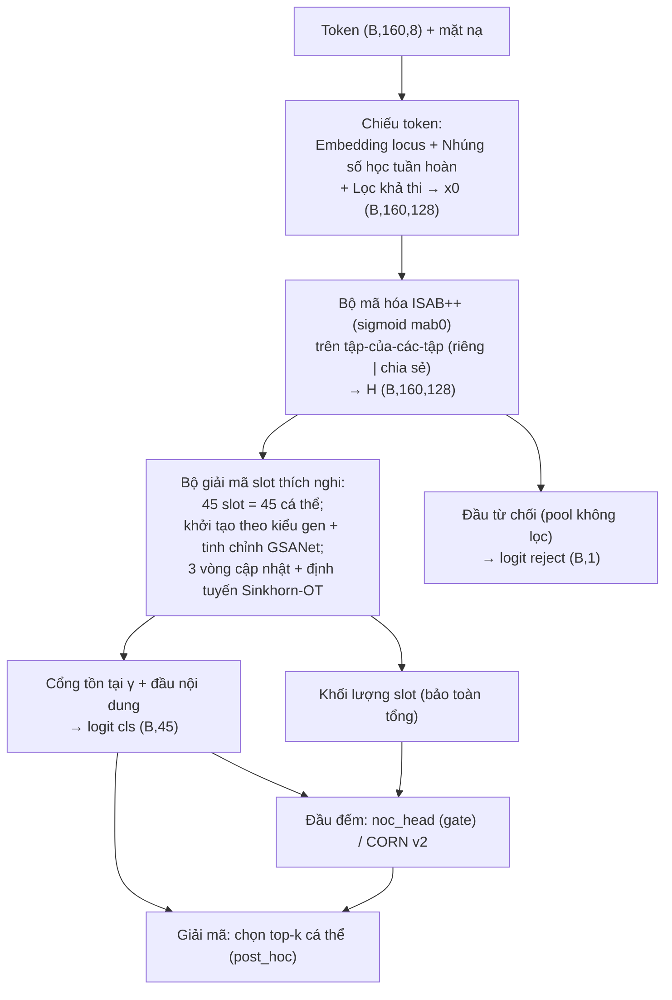

Báo cáo này tổng kết một quá trình thực nghiệm gồm ba giai đoạn nối tiếp nhau. Ở giai đoạn đầu, nhóm xây dựng và đánh giá hệ **deepNoC** — một chuỗi mô hình học sâu tiến hóa từ mạng tích chập tới Transformer phân cấp (CNN → NoCFormer → NoCNet-v2) trên cơ sở dữ liệu PROVEDIt. Ở giai đoạn thứ hai, nhóm khảo sát hướng **NOC_DNA**, sử dụng các bộ phân loại học máy cổ điển (XGBoost, mạng tích chập một chiều, và mô hình TabPFN) trên đặc trưng bảng được thiết kế thủ công. Từ những giới hạn quan sát được ở cả hai hướng — rò rỉ dữ liệu, phụ thuộc nặng vào kỹ thuật đặc trưng thủ công, sụp đổ độ chính xác ở các lớp thiểu số, và đặc biệt là việc chỉ *đếm* số người đóng góp mà không *tách* được kiểu gen của từng cá thể — nhóm đề xuất mô hình cuối cùng dựa trên **Set Transformer** với bộ giải mã slot thích nghi và định tuyến vận chuyển tối ưu (Optimal Transport). Toàn bộ mã nguồn ba giai đoạn được nộp kèm.

## Tóm tắt (Abstract)

Xác định số người đóng góp (Number of Contributors, viết tắt là NoC) và giải chập kiểu gen của từng cá thể trong một mẫu DNA hỗn hợp là một trong những bài toán khó và quan trọng bậc nhất của di truyền học pháp y. Mỗi mẫu hỗn hợp được biểu diễn bằng biểu đồ điện di (electropherogram) trên các vị trí STR (Short Tandem Repeat): tại mỗi locus xuất hiện một *tập hợp* các đỉnh allele với chiều cao đo bằng đơn vị huỳnh quang tương đối (RFU), lẫn với nhiễu kỹ thuật như stutter, hiện tượng mất đỉnh (dropout) và đỉnh giả (drop-in). Các phương pháp xác suất hóa kiểu gen như STRmix, EuroForMix hay TrueAllele cho kết quả tốt nhưng đòi hỏi cố định trước số người đóng góp và có chi phí tính toán lớn; ngược lại, các phương pháp đếm allele tối đa lại đánh giá thấp khi xảy ra hiện tượng chồng lấp allele giữa nhiều người.

Báo cáo trình bày một hành trình thực nghiệm ba giai đoạn trên cơ sở dữ liệu PROVEDIt và đề xuất một kiến trúc học sâu mới. Hai giai đoạn đầu — hệ deepNoC (CNN, NoCFormer, NoCNet-v2) và hệ NOC_DNA (XGBoost, CNN một chiều, TabPFN) — đều mô hình hóa bài toán dưới dạng phân loại NoC năm lớp và đạt độ chính xác đếm cao (deepNoC trung thực đạt 0,927; TabPFN của NOC_DNA đạt micro-F1 0,970), nhưng đồng thời bộc lộ các giới hạn về rò rỉ dữ liệu, phụ thuộc đặc trưng thủ công, mất cân bằng lớp, và quan trọng nhất là không trả lời được câu hỏi *ai đã đóng góp*. Từ đó, nhóm đề xuất xem mỗi profile là một **tập hợp đỉnh không có thứ tự** và xử lý bằng kiến trúc Set Transformer. Bộ mã hóa dùng khối chú ý tập cảm ứng ISAB++ với chú ý dạng sigmoid không cạnh tranh để các đỉnh thiểu số mờ không bị các đỉnh chính lấn át; profile được mô hình hóa như một *tập của các tập* (đỉnh riêng và đỉnh chia sẻ được mã hóa tách biệt). Bộ giải mã là một mạng chú ý slot thích nghi trong đó mỗi slot tương ứng với một cá thể, được khởi tạo theo kiểu gen tham chiếu, tinh chỉnh lặp bằng cập nhật slot kết hợp định tuyến Sinkhorn xấp xỉ song ngẫu nhiên nhằm chống hiện tượng "giải thích lấn át" (explaining-away) của người đóng góp thiểu số, và một cổng tồn tại để bật/tắt từng slot. Số người đóng góp được ước lượng từ hồ sơ xác suất bằng một bộ hồi quy hậu kỳ. Trên tập kiểm thử chia theo *tổ hợp người đóng góp tách rời*, mô hình đạt độ khớp tập chính xác (exact-match) 0,9590, độ chính xác đếm NoC 0,9671, diện tích dưới đường ROC cho phát hiện mẫu ngoài tập 0,9985, và macro-F1 0,9824 — vừa vượt trội về độ tin cậy đếm so với cả hai đường cơ sở, vừa bổ sung năng lực giải chập kiểu gen mà các phương pháp đếm thuần túy không có.

## Các đóng góp chính của báo cáo (Highlight)

1. **Tái định nghĩa bài toán từ "đếm" sang "tách tập".** Thay vì chỉ phân loại số người đóng góp, nhóm mô hình hóa profile DNA như một tập đỉnh không thứ tự và dự đoán đồng thời *tập người đóng góp* (đa nhãn trên 45 cá thể) cùng *bản số tập* (số người đóng góp), nhờ đó vừa đếm vừa giải chập kiểu gen trong một mô hình huấn luyện đầu-cuối.

2. **Bộ giải mã slot thích nghi với định tuyến vận chuyển tối ưu.** Mỗi cá thể được biểu diễn bằng một slot có danh tính cố định, khởi tạo theo kiểu gen tham chiếu và tinh chỉnh lặp; định tuyến đỉnh–slot dùng chuẩn hóa Sinkhorn xấp xỉ song ngẫu nhiên để một đỉnh chia sẻ được phân bổ bằng chứng cho *nhiều* người mang nó, trực tiếp khắc phục hiện tượng giải thích lấn át khiến người đóng góp thiểu số bị bỏ sót.

3. **Bộ mã hóa ISAB++ với chú ý sigmoid không cạnh tranh và cấu trúc "tập của các tập".** Khối ISAB++ giảm độ phức tạp chú ý từ bậc hai xuống tuyến tính nhờ điểm cảm ứng; chú ý sigmoid tại bước gộp đầu tiên thay cho softmax để các đỉnh mờ giữ được tín hiệu; đỉnh riêng và đỉnh chia sẻ được mã hóa trong hai tập tách biệt dùng chung trọng số.

4. **Tín hiệu đếm bảo toàn khối lượng và đầu đếm thứ tự kết hợp đặc trưng vật lý.** Vì định tuyến chuẩn hóa là phép trung bình làm mất thông tin số lượng, mô hình khôi phục một tín hiệu "khối lượng slot" bảo toàn tổng; đầu đếm thứ tự dạng CORN kết hợp hồ sơ xác suất, đặc trưng đếm allele vật lý và khối lượng slot để ước lượng số người ở các mức cao.

5. **Quy trình dữ liệu chống rò rỉ và phát hiện mẫu ngoài tập.** Nhóm chỉ ra và khắc phục rò rỉ dữ liệu của các thử nghiệm trước bằng phép chia *theo tổ hợp người đóng góp tách rời*, xây dựng bộ sinh hỗn hợp in-silico hiện thực, và bổ sung đầu ra từ chối đạt diện tích dưới đường ROC 0,9985 cho phát hiện người lạ ngoài bảng tham chiếu.

## Từ khóa (Keywords)

Phân tích hỗn hợp DNA pháp y; Số người đóng góp (NoC); Set Transformer; Chú ý slot (slot attention); Định tuyến Sinkhorn / Vận chuyển tối ưu; Giải chập kiểu gen STR; Cơ sở dữ liệu PROVEDIt; Hàm mất mát bất đối xứng

---

## I. Giới thiệu (Introduction)

Giám định DNA là một trụ cột của khoa học hình sự hiện đại. Trong điều tra, các mẫu sinh học thu được tại hiện trường thường không thuần khiết mà là *hỗn hợp DNA* của nhiều cá thể. Công nghệ tiêu chuẩn để định kiểu là khuếch đại PCR đa biến nhiều locus STR rồi điện di mao quản, tạo ra một biểu đồ điện di gồm các đỉnh allele với chiều cao tỉ lệ với lượng DNA của mẫu, đo bằng đơn vị huỳnh quang tương đối [21, 22]. Các bộ kit thương mại như GlobalFiler™ khuếch đại đồng thời khoảng hai mươi tư locus trên sáu kênh màu [23]. Việc diễn giải đúng biểu đồ điện di là điều kiện tiên quyết cho mọi tính toán chứng cứ phía sau, bởi mọi sai sót ở khâu này sẽ lan truyền thành sai lệch trong kết luận trình bày trước tòa.

Bài toán trung tâm gồm hai câu hỏi gắn bó chặt chẽ: có bao nhiêu người đã đóng góp DNA vào mẫu, và kiểu gen của từng người là gì. Câu hỏi thứ nhất chính là ước lượng số người đóng góp; câu hỏi thứ hai là giải chập (deconvolution) kiểu gen. Số người đóng góp là tham số đầu vào bắt buộc của hầu hết phần mềm xác suất hóa kiểu gen [18]; một sai sót về tham số này sẽ làm lệch lớn tỉ số khả dĩ (likelihood ratio) — đại lượng định lượng sức mạnh chứng cứ [15, 16]. Tuy nhiên, ước lượng số người đóng góp rất khó vì ba lý do đan xen. Thứ nhất, allele của những người khác nhau có thể *chồng lấp* tại cùng một vị trí, khiến việc đếm trực tiếp số allele đánh giá thấp số người. Thứ hai, người đóng góp thiểu số — người chỉ góp một lượng DNA nhỏ — có thể bị *mất đỉnh* khi tín hiệu rơi xuống dưới ngưỡng phát hiện. Thứ ba, nhiễu kỹ thuật *stutter*, tức các đỉnh giả lệch một đơn vị lặp so với allele thật, rất dễ bị nhầm thành allele thực [24, 25, 26].

Các phương pháp đã có chia thành ba nhóm. Nhóm đếm allele tối đa suy ra số người từ số allele phân biệt nhiều nhất quan sát được trên một locus; phương pháp này đơn giản nhưng bị chệch xuống một cách có hệ thống khi allele chồng lấp, và Haned cùng cộng sự [1] đã chỉ ra ước lượng hợp lý cực đại vượt trội nó khi số người tăng. Công cụ NOCIt [2] tính phân phối hậu nghiệm của số người dựa trên mô hình chiều cao đỉnh đã hiệu chuẩn, chính xác hơn nhưng tốn kém và cần hiệu chuẩn riêng cho từng phòng thí nghiệm. Nhóm thứ hai là xác suất hóa kiểu gen liên tục — EuroForMix [11], STRmix [9, 10], TrueAllele [12] — dựa trên mô hình thống kê của chiều cao đỉnh, stutter và mất đỉnh; các công cụ này mạnh về diễn giải chứng cứ nhưng buộc phải cố định trước số người đóng góp và có chi phí tính toán lớn. Nhóm thứ ba là học máy trực tiếp từ đặc trưng biểu đồ điện di, mà tiêu biểu là PACE của Marciano và Adelman [3, 4] và bộ phân loại của Benschop cùng cộng sự [5]; hướng này nhanh và tự động nhưng phụ thuộc nặng vào kỹ thuật đặc trưng thủ công và dữ liệu huấn luyện. Gần đây, học sâu bắt đầu được áp dụng để đọc biểu đồ điện di và phân loại allele [44, 45, 46, 47] cũng như để giải thích dự đoán số người đóng góp [48].

Vấn đề cốt lõi mà các nghiên cứu trước chưa giải quyết trọn vẹn là: phần lớn chỉ *đếm* số người dưới dạng phân loại mà không *tách* được kiểu gen của từng cá thể; các mô hình học máy và học sâu trên dữ liệu pháp y nhỏ rất dễ quá khớp và đặc biệt dễ rò rỉ dữ liệu khi các bản sao kỹ thuật của cùng một hỗn hợp rơi vào cả tập huấn luyện lẫn kiểm thử; và các lớp có số người cao (bốn đến năm người) có quá ít mẫu nên độ chính xác sụp đổ. Báo cáo tiếp cận bài toán qua ba giai đoạn thực nghiệm. Hai giai đoạn đầu (deepNoC và NOC_DNA) xác nhận rằng việc *đếm* số người là khả thi với độ chính xác cao, nhưng cũng phơi bày các điểm yếu nêu trên. Giai đoạn cuối — đóng góp chính của báo cáo — tái định nghĩa bài toán: coi mỗi profile là một tập hợp đỉnh không thứ tự và dùng Set Transformer [29] để vừa giải chập kiểu gen (dự đoán đa nhãn tập người đóng góp) vừa đếm số người (bản số tập). Cách tiếp cận này khai thác tính *hoán vị–bất biến* tự nhiên của biểu đồ điện di, theo đó thứ tự liệt kê các đỉnh không mang ý nghĩa sinh học, đồng thời chia tập chống rò rỉ, sinh dữ liệu in-silico hiện thực, và bổ sung khả năng nhận biết tình huống mở.

## II. Các nghiên cứu liên quan (Related Works)

### II.1. Hướng thống kê: đếm allele và xác suất hóa kiểu gen

Phương pháp đếm allele tối đa là chuẩn vàng bảo thủ trong thực hành: nếu một locus quan sát được $k$ allele phân biệt thì số người đóng góp ít nhất là $\lceil k/2\rceil$. Tuy nhiên, vì hai người có thể chia sẻ allele, số allele quan sát thường nhỏ hơn tổng số allele thực, nên ước lượng này chệch xuống có hệ thống, đặc biệt khi số người tăng. Haned cùng cộng sự [1] cho thấy ước lượng hợp lý cực đại khắc phục được phần lớn độ chệch này, còn NOCIt [2] tiến xa hơn bằng cách tính phân phối hậu nghiệm đầy đủ của số người dựa trên một mô hình chiều cao đỉnh đã hiệu chuẩn; Mönich cùng cộng sự [20] cung cấp đặc tả thống kê của nhiễu nền làm nền tảng cho các ngưỡng phân tích.

Xác suất hóa kiểu gen liên tục mô hình hóa trực tiếp chiều cao đỉnh quan sát được. EuroForMix [11] dùng mô hình gamma cho chiều cao đỉnh và tối ưu hợp lý cực đại; STRmix dựa trên mô hình chiều cao đỉnh và stutter liên tục [9, 10] với suy diễn Monte Carlo chuỗi Markov; TrueAllele [12] theo hướng Bayes phân cấp; còn Cowell cùng cộng sự [7, 8] hình thức hóa việc tách hỗn hợp bằng mạng Bayes trên thông tin diện tích đỉnh. Các phương pháp này có nền tảng thống kê vững chắc và đã được thẩm định pháp lý [18], nhưng tất cả đều yêu cầu cố định số người đóng góp trước khi chạy, giả định một dạng phân phối tham số, và chịu chi phí tính toán cao. Slooten [15, 16] thậm chí đề xuất tích phân trên số người như một tham số gây nhiễu, cho thấy chính việc *ước lượng số người chính xác* mới là nút thắt; các khuyến nghị của ủy ban DNA thuộc Hội Di truyền pháp y quốc tế [13, 14] cũng nhấn mạnh phải xử lý mất đỉnh và đỉnh giả một cách xác suất.

### II.2. Hướng học máy từ đặc trưng biểu đồ điện di

PACE của Marciano và Adelman [3, 4] dùng học máy có giám sát trên hàng trăm đặc trưng được thiết kế thủ công — số allele, tổng và chênh lệch chiều cao, thống kê stutter — để ước lượng số người tới bốn hoặc năm, nhanh hơn nhiều bậc so với phương pháp xác suất. Benschop cùng cộng sự [5] phát triển một bộ phân loại tương tự đã được thẩm định trên dữ liệu thực, còn Veldhuis cùng cộng sự [48] bổ sung lớp giải thích cho dự đoán số người. Điểm chung của các phương pháp này là phụ thuộc mạnh vào chất lượng đặc trưng thủ công và các ngưỡng cứng như ngưỡng phân tích hay cửa sổ stutter, khiến khả năng tổng quát hóa qua các bộ kit hay điều kiện điện di khác nhau bị hạn chế [46].

### II.3. Hướng học sâu và các kiến trúc nền

Taylor cùng cộng sự là nhóm tiên phong "dạy" mạng nơ-ron đọc biểu đồ điện di: phân loại allele và artefact [44, 45], khảo sát khả năng tổng quát hóa qua các điều kiện chạy [46], và kết hợp mạng nơ-ron với xác suất hóa kiểu gen liên tục để loại bỏ nhu cầu ngưỡng phân tích [47]. Ở tầng kiến trúc, mô hình đề xuất kế thừa cơ chế chú ý (attention) [28], các khung học trên dữ liệu dạng tập hoán vị–bất biến như Deep Sets [30] và Set Transformer [29], kỹ thuật nhúng số học cho học sâu trên dữ liệu bảng [32], và hàm mất mát bất đối xứng cho phân loại đa nhãn mất cân bằng [31] (một mở rộng của Focal Loss [33]). Bộ giải mã slot khai thác ý tưởng chú ý slot trong học biểu diễn đối tượng và định tuyến entropic giữa các tập điểm bằng thuật toán Sinkhorn. Các đường cơ sở học máy bảng dùng XGBoost [39] và TabPFN, trong khi các tổng quan về học sâu trong di truyền học và genomics [40, 41, 42, 43] cũng như trong khoa học hình sự [49, 50, 51] cho thấy đây là hướng đang lên — nhưng việc *tách tập người đóng góp* bằng một kiến trúc tập vẫn còn bỏ ngỏ, và đó chính là khoảng trống báo cáo này lấp đầy.

### II.4. Các thử nghiệm tiền đề của nhóm

Trước khi đi tới mô hình đề xuất, nhóm đã hiện thực và đánh giá hai hệ thống, được trình bày ở đây như "trình độ tốt nhất nội bộ" để phân tích điểm mạnh và điểm yếu.

Hệ **deepNoC** dùng dữ liệu PROVEDIt kit GlobalFiler ở điều kiện điện di hai mươi lăm giây, biểu diễn mỗi profile thành một tensor ba chiều gồm hai mươi tư locus, tối đa năm mươi đỉnh mỗi locus và tám mươi chín đặc trưng mỗi đỉnh. Nhóm xây một chuỗi mô hình tiến hóa. Đường cơ sở đếm allele tối đa kết hợp rừng ngẫu nhiên chỉ đạt độ chính xác đếm khoảng 0,66 trên phép chia theo nhóm, xác nhận giới hạn của việc đếm allele thuần túy. Mô hình deepNoC theo kiến trúc tích chập nhiều tầng (đỉnh → locus → profile) tái lập công trình của Taylor và Humphries đạt khoảng 0,82, nhưng con số này tính trên một phép chia có rò rỉ nên không trung thực. NoCFormer, một Transformer phân cấp với đầu ra thứ tự, coi các đỉnh là một tập có mặt nạ và đạt 0,668 trên phép chia theo nhóm, song quá khớp nặng trên dữ liệu nhỏ. Mô hình tốt nhất của hệ là NoCNet-v2, kết hợp Deep Sets với chú ý lệch theo khoảng cách allele để mã hóa stutter và một đầu đếm đa khung nhìn, kèm pipeline suy luận tăng cường tại thời điểm kiểm thử và hiệu chỉnh độ chệch theo lớp; mô hình này từng đạt 0,943, nhưng sau khi nhóm phát hiện và loại bỏ rò rỉ dữ liệu — bể dữ liệu tổng hợp vô tình chứa profile đơn nguồn của tập kiểm thử — con số trung thực là 0,927 với macro-F1 0,653 trên chín trăm hai mươi ba profile kiểm thử. Bài học rút ra là cần một phép chia chống rò rỉ nghiêm ngặt, rằng lớp số người cao sụp đổ độ chính xác vì quá ít mẫu, rằng phần lớn lợi ích đến từ hiệu chỉnh độ chệch hậu kỳ vốn mong manh, và quan trọng nhất là mô hình *chỉ đếm* chứ không tách kiểu gen.

Hệ **NOC_DNA** tiếp cận theo hướng đặc trưng bảng thủ công trên dữ liệu PROVEDIt RD14-0003 kit GlobalFiler ở điều kiện năm giây. Biểu đồ điện di được tiền xử lý thành một ma trận chiều cao đỉnh thưa theo từng cặp (locus, allele) gồm hai trăm năm mươi ba đặc trưng, rồi phân loại số người thành năm lớp bằng ba mô hình, đánh giá bằng kiểm định chéo năm phần. Kết quả trung bình thể hiện trong bảng dưới đây.

| Mô hình | Micro-F1 | Macro-F1 | Macro-Recall |
|---|---|---|---|
| XGBoost [39] | 0,9414 ± 0,0100 | 0,8170 ± 0,0346 | 0,7672 |
| CNN một chiều | 0,9455 ± 0,0083 | 0,8329 ± 0,0300 | 0,7962 |
| TabPFN | 0,9704 ± 0,0096 | 0,9122 ± 0,0312 | 0,8859 |

Hệ NOC_DNA cho thấy học máy bảng, đặc biệt TabPFN, đếm rất tốt theo micro-F1, nhưng macro-recall thấp phản ánh khả năng nhận diện kém ở các lớp số người cao; toàn bộ kết quả phụ thuộc vào đặc trưng và ngưỡng thủ công (ngưỡng năm mươi RFU, cửa sổ stutter mười lăm phần trăm) nên khó tổng quát hóa qua kit hay điều kiện; việc đánh giá bằng kiểm định chéo trộn theo dòng có nguy cơ rò rỉ bản sao kỹ thuật làm con số trở nên lạc quan; và một lần nữa mô hình chỉ đếm chứ không tách kiểu gen.

Cả hai hệ đều quy bài toán về phân loại số người và đều đối mặt với rò rỉ dữ liệu, mất cân bằng lớp, phụ thuộc đặc trưng cùng hiệu chỉnh thủ công, và không trả lời được câu hỏi *ai đã đóng góp*. Đây chính là động lực dẫn tới mô hình Set Transformer ở mục sau: thay vì đếm, ta tách tập người đóng góp và xem số người như hệ quả tự nhiên của bản số tập, trên nền một biểu diễn tập hoán vị–bất biến và một quy trình dữ liệu trung thực.

## III. Mô hình đề xuất (Proposal Model)

### III.1. Tập dữ liệu

Cả ba giai đoạn đều dùng cơ sở dữ liệu công khai PROVEDIt của Đại học Boston [19], bộ dữ liệu chuẩn lớn nhất hiện nay về profile STR đơn nguồn và hỗn hợp. Mô hình đề xuất sử dụng tập con gồm các profile từ một đến năm người, kit GlobalFiler, đo trên máy 3500 với hai mươi chín chu kỳ khuếch đại, trải trên hai mươi tư locus chuẩn GlobalFiler; các allele giới tính X và Y được mã hóa bằng các giá trị số quy ước âm để hòa vào cùng một biểu diễn liên tục với các allele thường.

Mỗi mẫu được biểu diễn thành một *tập các đỉnh*, trong đó mỗi đỉnh là một quan sát gồm bộ ba locus, allele và chiều cao. Từ đó, một token được dựng cho mỗi đỉnh với tám trường: chỉ số locus ở dạng rời rạc, cùng bảy đặc trưng liên tục gồm giá trị allele, lô-ga-rit của chiều cao tính theo công thức $\log(1+h)$, cân bằng chiều cao trong locus, tỉ lệ stutter, hạng chiều cao, số đỉnh trong locus, và chiều cao tương đối so với đỉnh lớn nhất toàn profile. Mỗi mẫu được đệm tới tối đa một trăm sáu mươi token kèm một mặt nạ đánh dấu token hợp lệ. Nhãn của mẫu là một vector đa nhãn bốn mươi lăm chiều trên tập bốn mươi lăm cá thể đã biết; số người đóng góp của mẫu bằng tổng số nhãn dương. Bộ dữ liệu gồm năm mươi cá thể, trong đó theo một hoán vị cố định với hạt giống bốn mươi hai, bốn mươi lăm cá thể được dùng làm lớp dự đoán và năm cá thể được giữ làm "người lạ" để huấn luyện khả năng từ chối mẫu ngoài tập. Tập kiểm thử cuối cùng có phân bố theo số người như sau: hai nghìn hai trăm bốn mươi chín mẫu một người, ba trăm ba mươi tư mẫu hai người, ba trăm tám mươi lăm mẫu ba người, hai trăm bốn mươi hai mẫu bốn người, và ba trăm bảy mươi hai mẫu năm người.

Điểm khác biệt then chốt về phương pháp luận so với hai thử nghiệm trước là cách chia tập nhằm chống rò rỉ. Các profile đơn nguồn được phân tầng theo cá thể để mọi cá thể đều xuất hiện ở cả ba tập huấn luyện, kiểm chứng và kiểm thử. Các profile hỗn hợp được gán *theo tổ hợp người đóng góp*: mỗi tổ hợp cụ thể chỉ thuộc duy nhất một trong ba tập, nhờ đó không tổ hợp nào xuất hiện đồng thời ở tập huấn luyện và tập kiểm thử, loại bỏ tận gốc dạng rò rỉ đã làm thổi phồng kết quả của deepNoC. Dữ liệu in-silico chỉ được thêm vào tập huấn luyện, trong khi tập kiểm chứng và kiểm thử luôn là dữ liệu thực được chuyển qua nguyên trạng. Cần lưu ý rằng vì PROVEDIt RD14-0003 chỉ gồm năm mươi cá thể, không thể chia tách rời hoàn toàn theo cá thể; phép chia theo tổ hợp do đó đo khả năng tổng quát hóa sang những *hỗn hợp mới của các cá thể đã biết*, một giới hạn cố hữu của mọi nghiên cứu số người đóng góp trên PROVEDIt.

Để bù dữ liệu cho các lớp số người cao vốn hiếm gặp, nhóm sinh thêm hỗn hợp in-silico theo một mô hình đỉnh kiểu EuroForMix. Quy trình lấy mẫu một số lượng người từ hai đến năm với tỉ lệ đóng góp lấy theo phân phối Dirichlet (trong đó mười lăm phần trăm trường hợp được làm cân bằng hoàn hảo để mô phỏng các hỗn hợp tỉ lệ đều khó tách); chiều cao kỳ vọng tại mỗi vị trí bằng tích của một mức biên độ chung, tỉ lệ đóng góp, liều gen và một hệ số suy giảm theo kích thước đoạn; chiều cao quan sát được lấy từ phân phối Gamma dị phương sai để tái tạo cái đuôi mờ hiện thực; sau đó thêm stutter ngược và áp mất đỉnh dưới ngưỡng phân tích. Bộ sinh loại trừ các tổ hợp thuộc tập kiểm chứng và kiểm thử để giữ kỷ luật chia tập.

### III.2. Kiến trúc của mô hình đề xuất

Toàn bộ mô hình nhận đầu vào là ma trận token $X\in\mathbb{R}^{B\times N\times 8}$ cùng mặt nạ hợp lệ, trong đó $B$ là kích thước lô, $N=160$ là số token sau khi đệm. Ký hiệu dùng xuyên suốt: $d=128$ là chiều ẩn của mô hình, $K=C=45$ là số cá thể (cũng là số lớp và số slot), $H$ là tập đỉnh sau khi mã hóa, các đầu ra cuối là logit phân loại đa nhãn $\ell^{\mathrm{cls}}\in\mathbb{R}^{B\times 45}$, logit đếm và logit từ chối. Dòng xử lý tổng thể đi từ phép chiếu token, qua bộ mã hóa ISAB++ trên cấu trúc tập-của-các-tập, tới bộ giải mã slot thích nghi với định tuyến Sinkhorn, rồi tách thành ba nhánh đầu ra là phân loại cá thể, đếm số người và từ chối mẫu ngoài tập. Sơ đồ tổng thể được phác như sau (bản phác này dùng để chuyển sang công cụ vẽ diagrams.net khi nộp).

**Phép chiếu token và nhúng số học tuần hoàn.** Cột đầu của mỗi token là chỉ số locus, được tra qua một bảng embedding để thành vector mười sáu chiều; bảy đặc trưng liên tục còn lại được chuẩn hóa theo trung bình và độ lệch chuẩn ước lượng trên tập huấn luyện, rồi đưa qua một bộ nhúng số học tuần hoàn. Với mỗi đặc trưng $j$ và giá trị đã chuẩn hóa $x_j$, bộ nhúng tính một tập tần số học được $c_j$ và tạo véc-tơ đặc trưng

$$
\phi(x_j)=\big[\sin(2\pi c_j x_j),\ \cos(2\pi c_j x_j)\big],
$$

sau đó cho qua một lớp tuyến tính riêng cho từng đặc trưng kèm phi tuyến ReLU. Mục đích của phép biến đổi tuần hoàn này là tránh việc trộn lẫn những đặc trưng có thang đo và bản chất rất khác nhau — chẳng hạn giá trị allele rời rạc và chiều cao đỉnh biến thiên hàng chục nghìn đơn vị — trên cùng một trục tuyến tính, đồng thời giúp mạng học được các quan hệ tuần hoàn và ngưỡng tinh tế trong dữ liệu liên tục [32]. Vector locus và vector số học được ghép lại rồi chiếu tuyến tính về chiều ẩn $d=128$, cho ma trận đỉnh ban đầu $x_0\in\mathbb{R}^{B\times N\times d}$. Trước khi vào bộ mã hóa, một bước *lọc khả thi* loại bỏ các đỉnh không tương thích với bất kỳ cá thể nào trong bảng tham chiếu: nếu một đỉnh có allele mà không cá thể nào trong bốn mươi lăm cá thể mang nó, đỉnh đó bị đưa vào mặt nạ đệm và triệt tiêu trong embedding. Bước lọc này được áp dụng nhất quán ở cả huấn luyện lẫn suy luận nên không gây lệch phân phối, và để các allele của người lạ vẫn đến được nhánh từ chối, nhánh này được tính trên một bản mã hóa lại *không lọc* và đã ngắt gradient.

**Bộ mã hóa ISAB++ với chú ý sigmoid không cạnh tranh.** Bộ mã hóa gồm hai khối chú ý tập cảm ứng cải tiến, gọi tắt là ISAB++. Mỗi khối dùng một tập gồm ba mươi hai *điểm cảm ứng* học được, ký hiệu $I$. Khối tính chú ý theo hai bước: trước hết các điểm cảm ứng tổng hợp thông tin từ toàn bộ $N$ đỉnh để tạo một bản tóm tắt cô đọng, sau đó các đỉnh đọc lại bản tóm tắt đó. Nhờ chèn lớp trung gian ba mươi hai điểm cảm ứng, độ phức tạp chú ý giảm từ bậc hai $O(N^2)$ xuống còn tuyến tính $O(Nm)$ theo số đỉnh, trong đó $m=32$. Một khối chú ý chuẩn tính trọng số bằng hàm softmax, tức một phép trung bình có trọng số chuẩn hóa trên các đỉnh; nhưng ở bước gộp đầu tiên — nơi các điểm cảm ứng đọc các đỉnh — chuẩn hóa softmax khiến các đỉnh chính rất cao chiếm gần như toàn bộ khối lượng và một đỉnh thiểu số mờ bị rửa trôi. Để khắc phục, bước này dùng *chú ý sigmoid không cạnh tranh*: mỗi cặp (điểm cảm ứng, đỉnh) nhận một cổng độc lập trong khoảng từ không đến một thay vì cạnh tranh chia sẻ một khối lượng tổng bằng một. Cụ thể, với truy vấn $Q$, khóa $K$ và độ lệch hiệu chỉnh theo số khóa hợp lệ $b=-\log(\#\text{khóa hợp lệ})$, trọng số chú ý là

$$
A=\sigma\!\Big(\frac{QK^\top}{\sqrt{d_h}}+b\Big),
$$

không có bước chuẩn hóa theo hàng, trong đó $d_h$ là chiều mỗi đầu chú ý và $\sigma$ là hàm sigmoid. Vì các cổng độc lập, một đỉnh thiểu số mờ vẫn giữ được tín hiệu của riêng nó mà không bị các đỉnh chính lấn át; độ lệch $b$ đảm bảo tổng cổng không phình to khi số đỉnh tăng. Bước thứ hai (các đỉnh đọc lại bản tóm tắt) vẫn dùng softmax thông thường. Khối ISAB++ còn thay chuẩn hóa lớp tiêu chuẩn bằng *chuẩn hóa tập* — một phép chuẩn hóa dùng chung một cặp trung bình và phương sai vô hướng trên các phần tử hợp lệ của cả tập rồi mới co giãn theo từng đặc trưng — và dùng đường dẫn dư tiền chuẩn hóa để xếp chồng sâu ổn định trên dữ liệu nhỏ.

**Cấu trúc tập-của-các-tập.** Thay vì mã hóa toàn bộ đỉnh như một tập duy nhất, mô hình phân profile thành hai tập con dựa trên số cá thể mang mỗi allele. Với mỗi đỉnh, ta tra bảng quyền sở hữu allele để đếm số cá thể trong bảng tham chiếu mang allele đó; gọi số này là số người mang. Đỉnh có đúng một người mang được xem là *đỉnh riêng*, còn đỉnh có nhiều hơn một người mang là *đỉnh chia sẻ*. Hai tập con này được đưa qua cùng một chồng ISAB++ dùng chung trọng số nhưng với hai mặt nạ khác nhau, cho hai biểu diễn $H_{\text{riêng}}$ và $H_{\text{chia sẻ}}$, rồi cộng lại. Vì giá đỡ của hai tập rời nhau, phép cộng tương đương phép chọn:

$$
H=H_{\text{riêng}}+H_{\text{chia sẻ}}\in\mathbb{R}^{B\times N\times d}.
$$

Lý do của thiết kế này là để các đỉnh riêng của một người đóng góp thiểu số chỉ chú ý lẫn nhau trong tập riêng của chúng, không bị các đỉnh chia sẻ chiều cao lớn cuốn trôi qua cơ chế chú ý cạnh tranh — đây chính là một biểu hiện cấu trúc của nguyên tắc chống giải thích lấn át.

**Bộ giải mã slot thích nghi.** Đây là thay đổi cốt lõi so với phiên bản trước của mô hình. Bộ giải mã là một mạng chú ý slot trong đó có đúng bốn mươi lăm slot, mỗi slot gắn cố định với một cá thể trong bảng tham chiếu — tức slot thứ $c$ *chính là* người thứ $c$. Việc gắn danh tính cố định này loại bỏ bài toán ghép cặp slot–nhãn vốn có trong chú ý slot tổng quát. Khác với chú ý slot thông thường khởi tạo slot ngẫu nhiên, ở đây mỗi slot được khởi tạo *theo kiểu gen tham chiếu* của cá thể tương ứng: tập allele tham chiếu của người đó được đưa qua đúng cùng phép chiếu token như các đỉnh quan sát, rồi lấy trung bình có mặt nạ và chiếu qua một lớp khởi tạo bằng không, để ở thời điểm bắt đầu mỗi slot mang sẵn thông tin "người này nên có những allele nào". Một bước tinh chỉnh khởi tạo dùng đầu quy gán đỉnh: xác suất quy gán mỗi đỉnh về từng cá thể (sau khi bỏ cột nền tương ứng với artefact) được tổng hợp lại thành không gian slot và cộng vào slot qua một cổng dư, nhờ đó các đỉnh stutter hay nhiễu — vốn bị đọc là nền — không bơm bằng chứng giả vào slot.

Sau khởi tạo, slot được tinh chỉnh qua ba vòng lặp. Trong mỗi vòng, từ slot hiện tại sinh ra truy vấn $Q=W_q\,\mathrm{LN}(\text{slot})$, tính độ tương hợp với các đỉnh đã mã hóa $H$ bằng tích vô hướng có tỉ lệ

$$
\mathrm{aff}=\frac{Q\,(W_k H)^\top}{\sqrt{d}}\in\mathbb{R}^{B\times K\times N},
$$

rồi chuẩn hóa độ tương hợp này thành một kế hoạch định tuyến đỉnh–slot bằng thuật toán Sinkhorn (trình bày ngay dưới đây). Bằng chứng tổng hợp về mỗi slot là tổ hợp có trọng số của các giá trị đỉnh $V=W_v H$ theo kế hoạch định tuyến $A$, tức $\text{cập nhật}=A\,V$. Slot được cập nhật bằng một ô hồi tiếp dạng GRU lấy bằng chứng làm đầu vào và trạng thái slot cũ làm trạng thái ẩn, sau đó cộng thêm một khối tiến truyền có chuẩn hóa trước. Việc dùng GRU thay vì gán đè trực tiếp giúp slot tích lũy bằng chứng qua các vòng một cách ổn định.

**Định tuyến Sinkhorn và chống giải thích lấn át.** Trong chú ý slot tiêu chuẩn, kế hoạch gán được chuẩn hóa bằng softmax *theo chiều slot*, tạo cơ chế thắng-ăn-cả khiến một đỉnh chia sẻ bị một slot duy nhất "giành" lấy — đó chính là hiện tượng giải thích lấn át làm người đóng góp thiểu số bị bỏ sót. Để khắc phục, mô hình thay softmax bằng chuẩn hóa Sinkhorn entropic, cho một ma trận gán xấp xỉ *song ngẫu nhiên*: mỗi đỉnh phân bổ bằng chứng của nó một cách phân số cho *tất cả* các cá thể có khả năng mang nó, thay vì dồn hết cho một. Cụ thể, đặt $L=\mathrm{aff}/\varepsilon$ với tham số entropic $\varepsilon=0{,}05$ và che các đỉnh đệm bằng giá trị âm rất lớn, ta lặp năm lần hai bước chuẩn hóa trong miền lô-ga-rit:

$$
L \leftarrow L-\operatorname{logsumexp}_{c}(L),\qquad
L \leftarrow L-\operatorname{logsumexp}_{p}(L),
$$

trong đó bước thứ nhất lấy tổng theo chiều slot $c$ (chia khối lượng của mỗi đỉnh cho các slot — đây chính là đòn bẩy chống lấn át, cho phép chia sẻ phân số), còn bước thứ hai lấy tổng theo chiều đỉnh $p$ (biến mỗi hàng slot thành một phân phối hợp lệ trên các đỉnh để dùng cho phép tổng hợp bằng chứng). Kế hoạch định tuyến cuối cùng là $A=\exp(L)$. Tham số $\varepsilon$ nhỏ làm kế hoạch sắc nét, gần với gán cứng nhưng vẫn cho phép một đỉnh chia sẻ phục vụ nhiều người.

**Tín hiệu khối lượng bảo toàn và cổng tồn tại.** Vì định tuyến trên là phép trung bình chuẩn hóa theo hàng, thông tin về *số lượng* đỉnh thuộc về mỗi slot bị xóa — trong khi một bộ đếm tập về bản chất cần đến tổng chứ không phải trung bình. Mô hình khôi phục thông tin này bằng một tín hiệu *khối lượng slot* được tính ở lượt cuối, đã ngắt gradient, bằng cách softmax độ tương hợp theo chiều slot rồi cộng dồn trên các đỉnh:

$$
\text{khối lượng}_c=\sum_{p} \mathrm{softmax}_{c}\big(\mathrm{aff}\big)_{c,p}\, w_p,
$$

với $w_p$ là độ tin cậy của đỉnh. Đại lượng này cung cấp tín hiệu đếm bảo toàn tổng cho đầu đếm. Cuối bộ giải mã, mỗi slot đi qua hai đầu nhỏ: một *cổng tồn tại* cho logit $\gamma_c$ biểu thị "người $c$ có mặt hay không", và một đầu nội dung cho logit nhận dạng. Logit phân loại của cá thể $c$ là tổng hai thành phần này trong không gian logit,

$$
\ell^{\mathrm{cls}}_c=\underbrace{\text{nội dung}(\text{slot}_c)}_{\text{nhận dạng}}+\underbrace{\gamma_c}_{\text{tồn tại}},
$$

theo đó một slot bị tắt (giá trị $\gamma_c$ rất âm) sẽ triệt tiêu cá thể tương ứng, còn slot được bật để cho thành phần nhận dạng quyết định. Trong huấn luyện, cổng tồn tại dùng nhiễu logistic trung bình không và phép lấy mẫu Gumbel-sigmoid để có thể lan truyền gradient qua quyết định bật/tắt rời rạc mà không thiên lệch về phía "luôn bật" gây đếm thừa; khi suy luận, cổng đơn giản là $\sigma(\gamma_c)$.

### III.3. Các đầu ra, hàm mất mát và chiến lược giải mã

Mô hình có ba nhánh đầu ra chính cùng các đầu phụ chỉ dùng khi huấn luyện. Nhánh phân loại cho logit đa nhãn $\ell^{\mathrm{cls}}\in\mathbb{R}^{B\times 45}$ như đã mô tả. Nhánh từ chối, gồm một lớp tuyến tính trên biểu diễn gộp toàn profile của bản mã hóa lại không lọc, cho một logit nhị phân phát hiện mẫu có chứa người đóng góp ngoài bảng bốn mươi lăm cá thể. Nhánh đếm thực ra gồm hai bộ ước lượng song song mà ta sẽ so sánh ở phần thực nghiệm: một đầu đếm đọc trực tiếp véc-tơ cổng tồn tại, và một đầu đếm thứ tự cải tiến. Ngoài ra, hai đầu phụ — quy gán từng đỉnh về cá thể và hồi quy tỉ lệ đóng góp — chỉ được giám sát bằng thông tin đặc quyền có ở dữ liệu in-silico và bị loại bỏ khi suy luận, nên không tốn chi phí trên dữ liệu thực.

Hàm mất mát phân loại là hàm mất mát bất đối xứng. Với mỗi cặp (mẫu, cá thể), gọi $p$ là xác suất dự đoán và $t\in\{0,1\}$ là nhãn thật, hàm này có dạng

$$
\mathcal{L}_{\mathrm{ASL}}=-\,t\,(1-p)^{\gamma_+}\log p\;-\;(1-t)\,\big(p_m\big)^{\gamma_-}\log\big(1-p_m\big),
$$

trong đó $p_m=\max(p-c_{\text{clip}},0)$ là xác suất âm đã dịch một lượng $c_{\text{clip}}=0{,}05$ để loại bỏ những mẫu âm quá dễ, và hai số mũ tập trung $\gamma_-=4$, $\gamma_+=0$ được chọn không đối xứng. Ý nghĩa là: vì trong bài toán này tỉ lệ nhãn dương rất nhỏ (mỗi mẫu chỉ có vài người trong số bốn mươi lăm cá thể), số mũ âm lớn hạ mạnh trọng số của vô số nhãn âm dễ, trong khi số mũ dương bằng không giữ nguyên tín hiệu cho các nhãn dương hiếm và khó. Tổng mất mát kết hợp ba thành phần với trọng số

$$
\mathcal{L}=\mathcal{L}_{\mathrm{ASL}}(\text{phân loại})+0{,}5\cdot\mathcal{L}_{\mathrm{BCE}}(\text{từ chối})+0{,}3\cdot\mathcal{L}_{\mathrm{CE}}(\text{đếm}),
$$

cùng các thành phần phụ được cân bằng bằng trọng số bất định đồng phương sai để mô hình tự điều chỉnh đóng góp của từng nhiệm vụ.

Khi suy luận, mọi chiến lược giải mã đều dùng chung bảng xếp hạng cá thể theo xác suất $P=\sigma(\ell^{\mathrm{cls}})$ và chỉ khác nhau ở chỗ giữ lại bao nhiêu người đứng đầu, tức ước lượng số người $\hat{k}$; sau đó $\hat{k}$ cá thể có xác suất cao nhất được đặt thành dương. Chiến lược *joint_card* lấy $\hat{k}$ từ đầu đếm đọc véc-tơ cổng; chiến lược *noc_v2* lấy $\hat{k}$ từ đầu đếm thứ tự cải tiến; chiến lược *post_hoc* huấn luyện một rừng ngẫu nhiên trên tập kiểm chứng để dự đoán $\hat{k}$ tối ưu từ hồ sơ xác suất; còn *oracle* dùng số người thật và chỉ đóng vai trò chặn trên lý thuyết. Đầu đếm thứ tự cải tiến đáng được mô tả kỹ vì nó tổng hợp ba nguồn tín hiệu bổ trợ: hồ sơ xác suất đã sắp xếp (tám xác suất lớn nhất, tổng xác suất, và số xác suất vượt một nửa), một nhóm đặc trưng đếm allele *vật lý* gồm số allele tối đa trên một locus tại nhiều ngưỡng chiều cao cùng các thống kê lô-ga-rit chiều cao, và tín hiệu khối lượng slot bảo toàn tổng đã nêu. Toàn bộ các đầu vào này được ngắt gradient và đưa qua một đầu thứ tự dạng CORN cho ra bốn ngưỡng tương ứng năm mức số người, đảm bảo tính nhất quán thứ tự giữa các ngưỡng. Đặc trưng đếm allele vật lý đóng vai trò một tín hiệu *không bão hòa* ở các mức số người cao, nơi mà tín hiệu xác suất của một người đóng góp thiểu số mờ thường quá yếu để nâng số đếm.

### III.4. Các độ đo đánh giá

Vì bài toán là dự đoán một tập đa nhãn kèm ước lượng bản số, nhóm dùng các độ đo sau. Độ đo nghiêm ngặt nhất là *khớp tập chính xác*, ký hiệu EM, bằng tỉ lệ mẫu mà toàn bộ tập cá thể dự đoán trùng khớp hoàn toàn với tập thật:

$$
\mathrm{EM}=\frac{1}{M}\sum_{i=1}^{M}\mathbf{1}\big[\hat{y}_i=y_i\big],
$$

trong đó chỉ cần sai một cá thể là cả mẫu bị tính sai. Bên cạnh đó, chỉ số F1 được tính theo hai cách: micro-F1 gộp toàn bộ quyết định nhị phân và do đó thiên về các lớp đa số, còn macro-F1 lấy trung bình F1 theo từng lớp nên nhạy với lớp thiểu số; cả hai dựa trên độ chính xác $P=\mathrm{TP}/(\mathrm{TP}+\mathrm{FP})$ và độ phủ $R=\mathrm{TP}/(\mathrm{TP}+\mathrm{FN})$ với $F1=2PR/(P+R)$. Mất mát Hamming đo tỉ lệ nhãn bị gán sai trên tổng số nhãn, phạt từng cá thể sai lệch; chỉ số Jaccard đo độ chồng lấp giữa tập dự đoán và tập thật theo công thức $|\hat{y}\cap y|/|\hat{y}\cup y|$. Riêng cho mục tiêu đếm, *độ chính xác đếm số người* là tỉ lệ mẫu mà số người dự đoán bằng đúng số người thật, đây là độ đo so sánh trực tiếp với hai đường cơ sở; ta cũng tách EM theo từng mức số người để soi khả năng ở các lớp khó. Cuối cùng, *diện tích dưới đường ROC cho từ chối* đo năng lực phân biệt mẫu đóng (chỉ chứa người đã biết) với mẫu mở (có chứa người lạ) dựa trên điểm số của nhánh từ chối.

## IV. Thử nghiệm và đánh giá (Experiments and Discussions)

### IV.1. Thử nghiệm

Mô hình đề xuất được huấn luyện bằng bộ tối ưu AdamW với tốc độ học $6\times 10^{-4}$ và hệ số suy giảm trọng số $10^{-4}$, lịch giảm tốc độ học theo nguyên lý dừng-trên-cao-nguyên, cắt chuẩn gradient ở mức một, kích thước lô hai trăm năm mươi sáu, tối đa một trăm năm mươi epoch và dừng sớm với kiên nhẫn hai mươi lăm epoch, tỉ lệ dropout là một phần mười. Một tăng cường dữ liệu quan trọng là *che đỉnh ngẫu nhiên* ở mức mười lăm phần trăm: ở mỗi bước, khoảng mười lăm phần trăm số đỉnh đầu vào bị bỏ đi (nhưng luôn giữ tối thiểu tám đỉnh để số người vẫn nhận diện được), buộc bộ giải mã phải suy luận tập người đóng góp từ một tập con, qua đó chống việc ghi nhớ tổ hợp. Tiêu chí chọn mô hình là độ phủ trung bình theo từng mức số người, một đại lượng không bão hòa và công bằng với các lớp số người cao hiếm gặp; mô hình tốt nhất đạt được ở epoch một trăm năm mươi với độ phủ trung bình trên tập kiểm chứng là 0,9716.

Về cấu hình phần cứng, mô hình được huấn luyện trên một GPU NVIDIA hỗ trợ CUDA dung lượng khoảng mười sáu gigabyte. Vì mô hình tương đối nhỏ — khoảng một triệu bốn trăm nghìn tham số — và biểu diễn token thưa, mỗi epoch chỉ tốn từ vài giây tới vài chục giây, nên tổng thời gian huấn luyện ước tính dưới một giờ cho toàn bộ một trăm năm mươi epoch. Suy luận chỉ là một lượt truyền xuôi cho mỗi mẫu, không cần tăng cường tại thời điểm kiểm thử, nên nhanh và phù hợp triển khai thực tế. (Khi nộp bài, phần cấu hình phần cứng và thời gian nên được cập nhật bằng thông số đo thực tế trên máy chạy.)

Kết quả trên tập kiểm thử thực chia theo tổ hợp tách rời được tổng hợp trong bảng dưới đây. Chiến lược giải mã được triển khai là *post_hoc*, vì nó cho khớp tập chính xác cao nhất.

| Độ đo | Giá trị |
|---|---|
| Khớp tập chính xác (post_hoc, triển khai) | 0,9590 |
| Khớp tập chính xác (đầu đếm thứ tự v2) | 0,9190 |
| Khớp tập chính xác (joint_card) | 0,8601 |
| Khớp tập chính xác (oracle, chặn trên) | 0,9726 |
| Độ chính xác đếm số người | 0,9671 |
| Macro-F1 | 0,9824 |
| Micro-F1 | 0,9832 |
| Độ chính xác / Độ phủ | 0,9774 / 0,9884 |
| Jaccard | 0,9853 |
| Mất mát Hamming | 0,0014 |
| Diện tích dưới đường ROC cho từ chối | 0,9985 |

Để hiểu hành vi theo độ khó, bảng tiếp theo tách khớp tập chính xác theo từng mức số người, so sánh chiến lược triển khai với chặn trên oracle.

| Số người | Số mẫu kiểm thử | EM (post_hoc) | EM (oracle) |
|---|---|---|---|
| 1 | 2249 | 0,9969 | 0,9978 |
| 2 | 334 | 0,9551 | 0,9910 |
| 3 | 385 | 0,9169 | 0,9714 |
| 4 | 242 | 0,9298 | 0,9339 |
| 5 | 372 | 0,7957 | 0,8306 |

### IV.2. Đánh giá

Mô hình đề xuất khớp tập hoàn toàn 95,90 phần trăm số mẫu và đếm đúng số người 96,71 phần trăm, trong khi đồng thời tách kiểu gen — điều mà cả deepNoC lẫn NOC_DNA không làm được. Một quan sát then chốt là khoảng cách giữa chặn trên oracle (0,9726) và chiến lược triển khai (0,9590) khá hẹp: điều này cho thấy *bảng xếp hạng cá thể đã gần như hoàn hảo*, và phần lớn sai số còn lại nằm ở khâu ước lượng số người chứ không phải ở khâu nhận dạng. Đây là minh chứng trực tiếp cho hiệu quả của bộ giải mã slot kết hợp định tuyến Sinkhorn và cấu trúc tập-của-các-tập trong việc chống giải thích lấn át.

So sánh ba chiến lược giải mã làm rõ vì sao chiến lược hậu kỳ được chọn. Chiến lược joint_card đọc số người từ đầu cổng tồn tại lại sụp đổ ở các mức cao — khớp tập chính xác của nó ở mức năm người bằng không vì xác suất của người đóng góp thiểu số quá thấp để nâng số đếm, một biểu hiện kinh điển của việc gộp không đếm được. Đầu đếm thứ tự cải tiến khắc phục đáng kể ở mức cao nhờ bổ sung đặc trưng đếm allele vật lý không bão hòa, nhưng lại thêm nhiễu ở các mức trung gian vốn đã được tín hiệu xác suất giải quyết tốt. Chiến lược hậu kỳ — một rừng ngẫu nhiên huấn luyện trên tập kiểm chứng để học trực tiếp ánh xạ từ hồ sơ xác suất sang số người tối ưu — cho hồ sơ cân bằng nhất qua mọi mức và đạt khớp tập chính xác cao nhất, nên được triển khai. Bản chất, vì bảng xếp hạng đã gần hoàn hảo, khâu còn lại thuần túy là một bài toán ước lượng số đếm trên hồ sơ xác suất sạch, và một bộ ước lượng hậu kỳ dữ liệu hóa giải quyết khâu này tốt hơn cả hai đầu đếm học trong mô hình.

Bảng dưới đây đặt mô hình đề xuất bên cạnh các đường cơ sở và thử nghiệm tiền đề. Cần nhấn mạnh rằng việc so sánh trực tiếp phải thận trọng vì cả *bài toán* lẫn *phép chia dữ liệu* đều khác nhau: NOC_DNA báo cáo micro-F1 trên kiểm định chéo trộn theo dòng (có nguy cơ rò rỉ bản sao nên lạc quan), deepNoC báo cáo độ chính xác trên phép chia theo nhóm, còn mô hình đề xuất dùng phép chia theo tổ hợp tách rời nghiêm ngặt hơn.

| Hệ thống | Bài toán | Phép chia | Đếm số người | Tách kiểu gen |
|---|---|---|---|---|
| Đếm allele tối đa | Đếm | Theo nhóm | ≈ 0,66 | Không |
| NoCFormer (deepNoC) | Đếm | Theo nhóm | 0,668 | Không |
| NoCNet-v2 (deepNoC, đã loại rò rỉ) | Đếm | Theo nhóm | 0,927 | Không |
| XGBoost (NOC_DNA) | Đếm | Kiểm định chéo | 0,941 (micro-F1) | Không |
| TabPFN (NOC_DNA) | Đếm | Kiểm định chéo | 0,970 (micro-F1) | Không |
| Set Transformer (đề xuất) | Đếm và tách tập | Theo tổ hợp tách rời | 0,9671 | Có (EM 0,9590) |

Nhận xét tổng quát là: ngay cả trên phép chia chống rò rỉ chặt nhất, mô hình đề xuất vẫn cho độ chính xác đếm số người (0,9671) vượt kết quả trung thực của NoCNet-v2 (0,927) mà không cần tới tăng cường tại thời điểm kiểm thử hay hiệu chỉnh độ chệch hậu kỳ mong manh. Nhưng điều quan trọng hơn con số là *năng lực*: mô hình đề xuất là hệ duy nhất giải chập được kiểu gen, đạt khớp tập chính xác 0,9590, và là hệ duy nhất xử lý được tình huống mẫu mở với diện tích dưới đường ROC cho từ chối lên tới 0,9985. Đây là một bước nhảy về khả năng chứ không chỉ là một cải thiện điểm số.

### IV.3. Các đóng góp chính của bài báo

Đóng góp đầu tiên là một khung tập hoán vị–bất biến cho phân tích hỗn hợp DNA, chuyển bài toán từ đếm sang tách tập người đóng góp kèm đếm bản số, qua đó giải quyết đồng thời hai câu hỏi cốt lõi của giám định trong một mô hình duy nhất. Đóng góp thứ hai là bộ giải mã slot thích nghi với định tuyến Sinkhorn, trong đó mỗi cá thể là một slot có danh tính cố định khởi tạo theo kiểu gen, và định tuyến xấp xỉ song ngẫu nhiên cho phép chia sẻ bằng chứng phân số để chống giải thích lấn át — gốc rễ của việc bỏ sót người đóng góp thiểu số. Đóng góp thứ ba là bộ mã hóa ISAB++ với chú ý sigmoid không cạnh tranh và cấu trúc tập-của-các-tập, giữ được tín hiệu của các đỉnh mờ và tách dòng chú ý của đỉnh riêng khỏi đỉnh chia sẻ. Đóng góp thứ tư là cặp cơ chế đếm gồm tín hiệu khối lượng slot bảo toàn tổng và đầu đếm thứ tự kết hợp đặc trưng đếm allele vật lý, nhằm xử lý các mức số người cao mà tín hiệu xác suất đơn thuần bão hòa. Đóng góp thứ năm là một quy trình dữ liệu trung thực gồm phép chia chống rò rỉ theo tổ hợp tách rời, bộ sinh hỗn hợp in-silico hiện thực, và năng lực phát hiện mẫu ngoài tập. Cuối cùng, báo cáo cung cấp một nghiên cứu thực nghiệm so sánh ba hướng tiếp cận trên cùng nền dữ liệu PROVEDIt, làm rõ vì sao biểu diễn tập là phù hợp nhất cho bài toán này.

## V. Kết luận (Conclusions and Perspectives)

Báo cáo trình bày một hành trình ba giai đoạn nhằm ước lượng số người đóng góp và giải chập kiểu gen từ hỗn hợp DNA pháp y. Các thử nghiệm tiền đề deepNoC, với NoCNet-v2 trung thực đạt 0,927, và NOC_DNA, với TabPFN đạt micro-F1 0,970, xác nhận tính khả thi của việc đếm số người bằng học sâu và học máy, nhưng đồng thời phơi bày các giới hạn về rò rỉ dữ liệu, phụ thuộc đặc trưng thủ công, sụp đổ ở lớp thiểu số, và việc không tách được kiểu gen. Mô hình đề xuất dựa trên Set Transformer với bộ giải mã slot thích nghi khắc phục các giới hạn đó: trên tập kiểm thử chia theo tổ hợp tách rời, mô hình đạt khớp tập chính xác 0,9590, độ chính xác đếm số người 0,9671, macro-F1 0,9824, và diện tích dưới đường ROC cho từ chối 0,9985, đồng thời tách được kiểu gen và phát hiện được mẫu mở, tất cả trong một lượt truyền xuôi duy nhất không cần tăng cường tại thời điểm kiểm thử hay hiệu chỉnh độ chệch.

Về hướng phát triển, trước hết cần mở rộng dữ liệu sang nhiều bộ kit và nhiều điều kiện điện di để kiểm chứng khả năng tổng quát hóa chéo kit [46]. Tiếp đó, khi có bộ dữ liệu nhiều cá thể hơn, nên thực hiện phép chia tách rời thực sự theo cá thể để vượt giới hạn năm mươi cá thể của PROVEDIt. Một hướng giàu tiềm năng là tích hợp đầu ra tập cùng tỉ lệ đóng góp làm khởi tạo hoặc ràng buộc cho các phần mềm xác suất hóa kiểu gen liên tục như EuroForMix hay STRmix [47], nhằm xuất ra tỉ số khả dĩ phục vụ tòa án. Việc lượng hóa độ bất định và tăng khả năng giải thích cho từng dự đoán cá thể [48] cũng cần thiết cho ứng dụng pháp y. Cuối cùng, cải thiện mô hình stutter và mất đỉnh trong bộ sinh in-silico, cùng với tiền huấn luyện tự giám sát trên kho biểu đồ điện di chưa gán nhãn, là con đường để nâng khớp tập chính xác ở mức năm người — hiện còn ở mức 0,7957 và là điểm nghẽn rõ rệt nhất còn lại của mô hình.

## Tài liệu tham khảo (References)

[1] Haned, H., Pène, L., Lobry, J. R., Dufour, A. B., & Pontier, D. (2011). Estimating the number of contributors to forensic DNA mixtures: Does maximum likelihood perform better than maximum allele count? *Journal of Forensic Sciences, 56*(1), 23–28. https://doi.org/10.1111/j.1556-4029.2010.01550.x

[2] Swaminathan, H., Grgicak, C. M., Médard, M., & Lun, D. S. (2015). NOCIt: A computational method to infer the number of contributors to DNA samples analyzed by STR genotyping. *Forensic Science International: Genetics, 16*, 172–180. https://doi.org/10.1016/j.fsigen.2014.11.010

[3] Marciano, M. A., & Adelman, J. D. (2017). PACE: Probabilistic Assessment for Contributor Estimation — A machine learning-based assessment of the number of contributors in DNA mixtures. *Forensic Science International: Genetics, 27*, 82–91. https://doi.org/10.1016/j.fsigen.2016.11.006

[4] Marciano, M. A., & Adelman, J. D. (2019). Developmental validation of PACE™: Automated artifact identification and contributor estimation for use with GlobalFiler™ and PowerPlex® Fusion 6c generated data. *Forensic Science International: Genetics, 43*, Article 102140. https://doi.org/10.1016/j.fsigen.2019.102140

[5] Benschop, C. C. G., van der Linden, J., Hoogenboom, J., Ypma, R., & Haned, H. (2019). Automated estimation of the number of contributors in autosomal short tandem repeat profiles using a machine learning approach. *Forensic Science International: Genetics, 43*, Article 102150. https://doi.org/10.1016/j.fsigen.2019.102150

[6] Kruijver, M. (2015). Efficient computations with the likelihood ratio distribution. *Forensic Science International: Genetics, 14*, 116–124. https://doi.org/10.1016/j.fsigen.2014.09.018

[7] Cowell, R. G., Lauritzen, S. L., & Mortera, J. (2007). Identification and separation of DNA mixtures using peak area information. *Forensic Science International, 166*(1), 28–34. https://doi.org/10.1016/j.forsciint.2006.03.021

[8] Cowell, R. G., Graversen, T., Lauritzen, S. L., & Mortera, J. (2015). Analysis of forensic DNA mixtures with artefacts. *Journal of the Royal Statistical Society: Series C (Applied Statistics), 64*(1), 1–48. https://doi.org/10.1111/rssc.12071

[9] Bright, J.-A., Taylor, D., Curran, J. M., & Buckleton, J. S. (2013). Developing allelic and stutter peak height models for a continuous method of DNA interpretation. *Forensic Science International: Genetics, 7*(2), 296–304. https://doi.org/10.1016/j.fsigen.2012.11.013

[10] Taylor, D., Bright, J.-A., & Buckleton, J. (2013). The interpretation of single source and mixed DNA profiles. *Forensic Science International: Genetics, 7*(5), 516–528. https://doi.org/10.1016/j.fsigen.2013.05.011

[11] Bleka, Ø., Storvik, G., & Gill, P. (2016). EuroForMix: An open source software based on a continuous model to evaluate STR DNA profiles from a mixture of contributors with artefacts. *Forensic Science International: Genetics, 21*, 35–44. https://doi.org/10.1016/j.fsigen.2015.11.008

[12] Perlin, M. W., Legler, M. M., Spencer, C. E., Smith, J. L., Allan, W. P., Belrose, J. L., & Duceman, B. W. (2011). Validating TrueAllele DNA mixture interpretation. *Journal of Forensic Sciences, 56*(6), 1430–1447. https://doi.org/10.1111/j.1556-4029.2011.01859.x

[13] Gill, P., Brenner, C. H., Buckleton, J. S., Carracedo, A., Krawczak, M., Mayr, W. R., Morling, N., Prinz, M., Schneider, P. M., & Weir, B. S. (2006). DNA commission of the International Society of Forensic Genetics: Recommendations on the interpretation of mixtures. *Forensic Science International, 160*(2–3), 90–101. https://doi.org/10.1016/j.forsciint.2006.04.009

[14] Gill, P., Gusmão, L., Haned, H., Mayr, W. R., Morling, N., Parson, W., Prieto, L., Prinz, M., Schneider, H., Schneider, P. M., & Weir, B. S. (2012). DNA commission of the International Society of Forensic Genetics: Recommendations on the evaluation of STR typing results that may include drop-out and/or drop-in using probabilistic methods. *Forensic Science International: Genetics, 6*(6), 679–688. https://doi.org/10.1016/j.fsigen.2012.06.002

[15] Slooten, K. (2017). Accurate assessment of the weight of evidence for DNA mixtures by integrating the likelihood ratio. *Forensic Science International: Genetics, 27*, 1–16. https://doi.org/10.1016/j.fsigen.2016.11.001

[16] Slooten, K., & Caliebe, A. (2018). Contributors are a nuisance (parameter) for DNA mixture evidence evaluation. *Forensic Science International: Genetics, 37*, 116–125. https://doi.org/10.1016/j.fsigen.2018.05.004

[17] Haned, H. (2011). Forensim: An open-source initiative for the evaluation of statistical methods in forensic genetics. *Forensic Science International: Genetics, 5*(4), 265–268. https://doi.org/10.1016/j.fsigen.2010.03.017

[18] Coble, M. D., & Bright, J.-A. (2019). Probabilistic genotyping software: An overview. *Forensic Science International: Genetics, 38*, 219–224. https://doi.org/10.1016/j.fsigen.2018.11.009

[19] Alfonse, L. E., Garrett, A. D., Lun, D. S., Duffy, K. R., & Grgicak, C. M. (2018). A large-scale dataset of single and mixed-source short tandem repeat profiles to inform human identification strategies: PROVEDIt. *Forensic Science International: Genetics, 32*, 62–70. https://doi.org/10.1016/j.fsigen.2017.10.006

[20] Mönich, U. J., Duffy, K., Médard, M., Cadambe, V., Alfonse, L. E., & Grgicak, C. (2015). Probabilistic characterisation of baseline noise in STR profiles. *Forensic Science International: Genetics, 19*, 107–122. https://doi.org/10.1016/j.fsigen.2015.07.001

[21] Butler, J. M. (2006). Genetics and genomics of core short tandem repeat loci used in human identity testing. *Journal of Forensic Sciences, 51*(2), 253–265. https://doi.org/10.1111/j.1556-4029.2006.00046.x

[22] Butler, J. M., Buel, E., Crivellente, F., & McCord, B. R. (2004). Forensic DNA typing by capillary electrophoresis using the ABI Prism 310 and 3100 genetic analyzers for STR analysis. *Electrophoresis, 25*(10–11), 1397–1412. https://doi.org/10.1002/elps.200305822

[23] Ludeman, M. J., Zhong, C., Mulero, J. J., Lagacé, R. E., Hennessy, L. K., Short, M. L., & Wang, D. Y. (2018). Developmental validation of GlobalFiler™ PCR amplification kit: A 6-dye multiplex assay designed for amplification of casework samples. *International Journal of Legal Medicine, 132*(6), 1555–1573. https://doi.org/10.1007/s00414-018-1817-5

[24] Brookes, C., Bright, J.-A., Harbison, S., & Buckleton, J. (2012). Characterising stutter in forensic STR multiplexes. *Forensic Science International: Genetics, 6*(1), 58–63. https://doi.org/10.1016/j.fsigen.2011.02.001

[25] Tvedebrink, T., Eriksen, P. S., Mogensen, H. S., & Morling, N. (2009). Estimating the probability of allelic drop-out of STR alleles in forensic genetics. *Forensic Science International: Genetics, 3*(4), 222–226. https://doi.org/10.1016/j.fsigen.2009.02.002

[26] Gill, P., Puch-Solis, R., & Curran, J. (2009). The low-template-DNA (stochastic) threshold—Its determination relative to risk analysis for national DNA databases. *Forensic Science International: Genetics, 3*(2), 104–111. https://doi.org/10.1016/j.fsigen.2008.11.009

[27] Gill, P., Whitaker, J., Flaxman, C., Brown, N., & Buckleton, J. (2000). An investigation of the rigor of interpretation rules for STRs derived from less than 100 pg of DNA. *Forensic Science International, 112*(1), 17–40. https://doi.org/10.1016/S0379-0738(00)00158-4

[28] Vaswani, A., Shazeer, N., Parmar, N., Uszkoreit, J., Jones, L., Gomez, A. N., Kaiser, Ł., & Polosukhin, I. (2017). Attention is all you need. In *Advances in Neural Information Processing Systems 30* (pp. 5998–6008). Curran Associates. https://proceedings.neurips.cc/paper/2017/hash/3f5ee243547dee91fbd053c1c4a845aa-Abstract.html

[29] Lee, J., Lee, Y., Kim, J., Kosiorek, A. R., Choi, S., & Teh, Y. W. (2019). Set Transformer: A framework for attention-based permutation-invariant neural networks. In *Proceedings of the 36th International Conference on Machine Learning* (PMLR Vol. 97, pp. 3744–3753). PMLR. https://proceedings.mlr.press/v97/lee19d.html

[30] Zaheer, M., Kottur, S., Ravanbakhsh, S., Póczos, B., Salakhutdinov, R., & Smola, A. J. (2017). Deep sets. In *Advances in Neural Information Processing Systems 30* (pp. 3391–3401). Curran Associates. https://proceedings.neurips.cc/paper/2017/hash/f22e4747da1aa27e363d86d40ff442fe-Abstract.html

[31] Ridnik, T., Ben-Baruch, E., Zamir, N., Noy, A., Friedman, I., Protter, M., & Zelnik-Manor, L. (2021). Asymmetric loss for multi-label classification. In *Proceedings of the IEEE/CVF International Conference on Computer Vision (ICCV)* (pp. 82–91). IEEE. https://doi.org/10.1109/ICCV48922.2021.00015

[32] Gorishniy, Y., Rubachev, I., & Babenko, A. (2022). On embeddings for numerical features in tabular deep learning. In *Advances in Neural Information Processing Systems 35* (pp. 24991–25004). Curran Associates. https://proceedings.neurips.cc/paper_files/paper/2022/hash/9e9f0ffc3d836836ca96cbf8fe14b105-Abstract-Conference.html

[33] Lin, T.-Y., Goyal, P., Girshick, R., He, K., & Dollár, P. (2017). Focal loss for dense object detection. In *Proceedings of the IEEE International Conference on Computer Vision (ICCV)* (pp. 2999–3007). IEEE. https://doi.org/10.1109/ICCV.2017.324

[34] Ioffe, S., & Szegedy, C. (2015). Batch normalization: Accelerating deep network training by reducing internal covariate shift. In *Proceedings of the 32nd International Conference on Machine Learning* (PMLR Vol. 37, pp. 448–456). PMLR. https://proceedings.mlr.press/v37/ioffe15.html

[35] Srivastava, N., Hinton, G., Krizhevsky, A., Sutskever, I., & Salakhutdinov, R. (2014). Dropout: A simple way to prevent neural networks from overfitting. *Journal of Machine Learning Research, 15*(1), 1929–1958. https://jmlr.org/papers/v15/srivastava14a.html

[36] Kingma, D. P., & Ba, J. (2015). Adam: A method for stochastic optimization. In *3rd International Conference on Learning Representations (ICLR)*. https://arxiv.org/abs/1412.6980

[37] Loshchilov, I., & Hutter, F. (2019). Decoupled weight decay regularization. In *7th International Conference on Learning Representations (ICLR)*. https://arxiv.org/abs/1711.05101

[38] Arik, S. Ö., & Pfister, T. (2021). TabNet: Attentive interpretable tabular learning. *Proceedings of the AAAI Conference on Artificial Intelligence, 35*(8), 6679–6687. https://doi.org/10.1609/aaai.v35i8.16826

[39] Chen, T., & Guestrin, C. (2016). XGBoost: A scalable tree boosting system. In *Proceedings of the 22nd ACM SIGKDD International Conference on Knowledge Discovery and Data Mining* (pp. 785–794). ACM. https://doi.org/10.1145/2939672.2939785

[40] LeCun, Y., Bengio, Y., & Hinton, G. (2015). Deep learning. *Nature, 521*(7553), 436–444. https://doi.org/10.1038/nature14539

[41] Libbrecht, M. W., & Noble, W. S. (2015). Machine learning applications in genetics and genomics. *Nature Reviews Genetics, 16*(6), 321–332. https://doi.org/10.1038/nrg3920

[42] Eraslan, G., Avsec, Ž., Gagneur, J., & Theis, F. J. (2019). Deep learning: New computational modelling techniques for genomics. *Nature Reviews Genetics, 20*(7), 389–403. https://doi.org/10.1038/s41576-019-0122-6

[43] Zou, J., Huss, M., Abid, A., Mohammadi, P., Torkamani, A., & Telenti, A. (2019). A primer on deep learning in genomics. *Nature Genetics, 51*(1), 12–18. https://doi.org/10.1038/s41588-018-0295-5

[44] Taylor, D., & Powers, D. (2016). Teaching artificial intelligence to read electropherograms. *Forensic Science International: Genetics, 25*, 10–18. https://doi.org/10.1016/j.fsigen.2016.07.013

[45] Taylor, D., Harrison, A., & Powers, D. (2017). An artificial neural network system to identify alleles in reference electropherograms. *Forensic Science International: Genetics, 30*, 114–126. https://doi.org/10.1016/j.fsigen.2017.07.002

[46] Taylor, D., Kitselaar, M., & Powers, D. (2019). The generalisability of artificial neural networks used to classify electrophoretic data produced under different conditions. *Forensic Science International: Genetics, 38*, 181–184. https://doi.org/10.1016/j.fsigen.2018.10.019

[47] Taylor, D., & Buckleton, J. (2023). Combining artificial neural network classification with fully continuous probabilistic genotyping to remove the need for an analytical threshold and electropherogram reading. *Forensic Science International: Genetics, 62*, Article 102787. https://doi.org/10.1016/j.fsigen.2022.102787

[48] Veldhuis, M. S., Ariëns, S., Ypma, R. J. F., Abeel, T., & Benschop, C. C. G. (2022). Explainable artificial intelligence in forensics: Realistic explanations for number of contributor predictions of DNA profiles. *Forensic Science International: Genetics, 56*, Article 102632. https://doi.org/10.1016/j.fsigen.2021.102632

[49] Vidaki, A., Ballard, D., Aliferi, A., Miller, T. H., Barron, L. P., & Syndercombe Court, D. (2017). DNA methylation-based forensic age prediction using artificial neural networks and next generation sequencing. *Forensic Science International: Genetics, 28*, 225–236. https://doi.org/10.1016/j.fsigen.2017.02.009

[50] Sessa, F., Esposito, M., Cocimano, G., Sablone, S., Karaboue, M. A. A., Chisari, M., Albano, D. G., & Salerno, M. (2024). Artificial intelligence and forensic genetics: Current applications and future perspectives. *Applied Sciences, 14*(5), Article 2113. https://doi.org/10.3390/app14052113

[51] Galante, N., Cotroneo, R., Furci, D., Lodetti, G., & Casali, M. B. (2023). Applications of artificial intelligence in forensic sciences: Current potential benefits, limitations and perspectives. *International Journal of Legal Medicine, 137*(2), 445–458. https://doi.org/10.1007/s00414-022-02928-5
