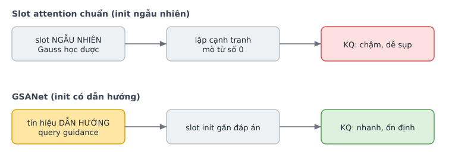
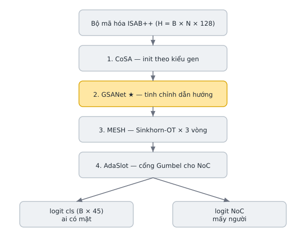
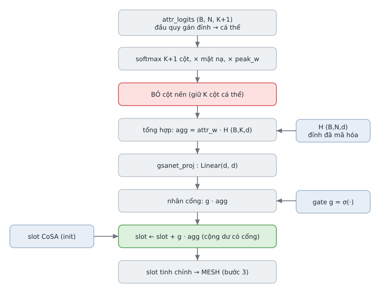
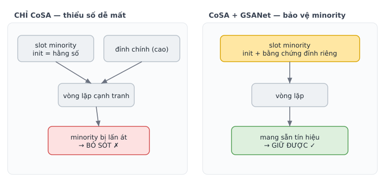

# GSANet — Khởi tạo slot có dẫn hướng trong Set Transformer

> **Slide-style.** Mỗi mục `---` là một "slide": một ý chính + một sơ đồ/bảng.
> Mở bằng VSCode (ext *Markdown Preview Mermaid*) hoặc xem thẳng trên GitHub để render sơ đồ.
> Code tham chiếu: `set_transformer.py:858` (`AdaptiveSlotDecoder`); khối GSANet dòng `904–908`, `941–956`.

---

## 0. TL;DR (một câu)

> **GSANet = bơm bằng chứng quan sát của *chính mẫu này* (qua đầu quy gán đỉnh) vào lúc
> khởi tạo slot, bằng một phép cộng dư *có cổng*, đồng thời gạt đỉnh nhiễu sang một cột
> "nền" riêng — để mỗi slot khởi đầu *gần đáp án*, không bỏ sót người đóng góp thiểu số,
> và không bị artefact đánh lừa.**

| | |
|---|---|
| Tên paper | *Guided Slot Attention for Unsupervised Video Object Segmentation* |
| Tác giả / nơi đăng | Lee et al. (Yonsei) — **CVPR 2024**, tr. 3807–3816 |
| Links | [arXiv 2303.08314](https://arxiv.org/abs/2303.08314) · [code gốc](https://github.com/Hydragon516/GSANet) |
| Vai trò trong mô hình | Bước **#2 / 4** trong bộ giải mã slot (`CoSA → GSANet → MESH → AdaSlot`) |
| Mượn cái gì | Nguyên tắc *khởi tạo slot có dẫn hướng* + *tách nền*. Không bê KNN/transformer gốc. |

---

## 1. GSANet gốc giải bài gì?

**Bài toán gốc:** phân vùng vật thể trong video không giám sát — tách vật thể nổi bật khỏi
nền phức tạp.

**Vấn đề của slot attention chuẩn (Locatello 2020):** slot khởi tạo **ngẫu nhiên** từ một
phân phối Gauss → slot không biết phải tìm gì, hội tụ chậm, dễ hoán đổi vai trò hoặc sụp về
cùng một vật thể.

**Đóng góp của GSANet:** thay khởi tạo ngẫu nhiên bằng **khởi tạo có dẫn hướng** (*query
guidance*) — slot tiền cảnh/nền bắt đầu từ một **tín hiệu bên ngoài**, rồi mới tinh chỉnh lặp.



> **Nguyên tắc rút ra (phần được mượn):** khi đã có tín hiệu đáng tin về việc *slot nào ứng
> với cái gì*, hãy bơm nó vào lúc khởi tạo — đừng để slot mò ra từ số 0.

---

## 2. Vị trí trong bộ giải mã: stack 4 kỹ thuật

`AdaptiveSlotDecoder` xếp chồng 4 ý tưởng từ 4 paper. GSANet là bước **#2**.



| Bước | Paper | Làm gì | Trả lời câu hỏi |
|------|-------|--------|-----------------|
| 1 CoSA | ICLR 2024 | Khởi tạo slot `c` từ **kiểu gen tham chiếu** của người `c` | "Người này *nên* có allele nào?" (tiên nghiệm) |
| **2 GSANet** | **CVPR 2024** | **Tinh chỉnh init bằng bằng chứng quan sát của mẫu** | **"Mẫu *này* thực sự có gì cho người đó?"** |
| 3 MESH | ICML 2023 | Vòng lặp định tuyến Sinkhorn-OT (chống lấn át) | "Chia đỉnh cho các slot ra sao?" |
| 4 AdaSlot | CVPR 2024 | Cổng Gumbel-Sigmoid bật/tắt slot | "Slot này có người thật không?" |

> CoSA cho **tiên nghiệm** (hằng số với mọi mẫu). GSANet thêm **hậu nghiệm theo mẫu**.
> Đây là lý do cần cả hai.

---

## 3. GSANet làm gì — sơ đồ luồng dữ liệu

Tín hiệu dẫn hướng ở đây = **attr logits**: đầu phụ (`aux_heads`) cho mỗi đỉnh một phân phối
"đỉnh này thuộc cá thể nào", gồm **K + 1 cột** (K cá thể **+ 1 cột nền** cho artefact/stutter).



**Code thật (`set_transformer.py:941–956`):**

```python
attr_w  = torch.softmax(attr_logits, dim=-1)         # (B,N,K+1)  softmax K+1 cột
attr_w  = attr_w[..., :K]                             # giữ K cột cá thể — BỎ cột nền
attr_w  = attr_w * (~pad_mask).float().unsqueeze(-1)  # triệt tiêu đỉnh đệm
attr_w  = attr_w * peak_w.unsqueeze(-1)               # đỉnh phantom đóng góp ít hơn
attr_agg = attr_w.transpose(1, 2) @ H                 # (B,K,d) tổng hợp đỉnh theo trọng số
attr_agg = self.gsanet_proj(attr_agg)                 # chiếu về không gian slot
g        = torch.sigmoid(self.gsanet_gate(attr_agg))  # (B,K,1) cổng tin cậy mỗi slot
slots    = slots + g * attr_agg                        # cộng dư có cổng
```

**Công thức:** với `H` = tập đỉnh mã hóa, `m_p` = mặt nạ đệm, `w_p` = độ tin cậy đỉnh:

$$
a_{p,\cdot}=\mathrm{softmax}_{K+1}\!\big(\text{attr\_logits}_{p,\cdot}\big),
\qquad
\tilde a_{p,c}=a_{p,c}\,(1-m_p)\,w_p
$$

$$
\mathrm{agg}_c=W_{\text{proj}}\Big(\sum_{p}\tilde a_{p,c}\,H_p\Big),
\qquad
g_c=\sigma\!\big(W_{\text{gate}}\,\mathrm{agg}_c\big),
\qquad
\boxed{\,s_c \leftarrow s_c + g_c\cdot \mathrm{agg}_c\,}
$$

---

## 4. Ba chi tiết quyết định (mỗi cái sửa một lỗi)

| # | Cơ chế | Sửa lỗi gì |
|---|--------|------------|
| 1 | **Bỏ cột nền** — softmax K+1 cột rồi vứt cột nền | Đỉnh stutter/artefact dồn khối lượng vào cột nền (bị bỏ) → **không bơm bằng chứng giả** vào slot cá thể nào. Chính là phép tách tiền cảnh/nền của GSANet gốc. |
| 2 | **Cộng dư có cổng** `g=σ(...)` | Mỗi slot tự quyết tin tín hiệu attr bao nhiêu. Attr không chắc → cổng đóng (`g→0`) → giữ nguyên init CoSA. GSANet **chỉ cải thiện, không phá** được. |
| 3 | **Trọng số `peak_w`** | Đỉnh phantom/thấp đóng góp ít → init slot không bị nhiễu kéo lệch. |

---

## 5. Ví dụ số (1 locus, 2 cá thể, 3 đỉnh)

Giả lập: K = 2 cá thể **A, B**; 3 đỉnh quan sát `p1, p2, p3`. `p3` là stutter (nhiễu).
Đầu attr cho ra (sau softmax trên 3 cột `[A, B, nền]`):

| Đỉnh | →A | →B | →nền | Giải thích |
|------|----|----|------|------------|
| p1 | **0.90** | 0.05 | 0.05 | rõ là allele của A |
| p2 | 0.05 | **0.85** | 0.10 | rõ là allele của B |
| p3 | 0.10 | 0.05 | **0.85** | stutter → đa số khối lượng vào **nền** |

Sau khi **bỏ cột nền**, trọng số còn lại dùng để tổng hợp:

- Slot **A** kéo về: `0.90·H(p1) + 0.05·H(p2) + 0.10·H(p3)` → chủ yếu bằng chứng `p1` ✔
- Slot **B** kéo về: `0.05·H(p1) + 0.85·H(p2) + 0.05·H(p3)` → chủ yếu bằng chứng `p2` ✔
- `p3` (stutter) chỉ góp **0.10 / 0.05** → **gần như không** làm bẩn slot nào ✔

> Kết quả: trước cả khi vòng Sinkhorn chạy, slot A đã "ngồi" gần bằng chứng của A, slot B
> gần bằng chứng của B, còn nhiễu p3 bị vô hiệu. Đó là cả ý nghĩa của GSANet.

---

## 6. Tại sao cần GSANet? (chống "explaining-away")

**Nếu chỉ có CoSA:** init slot là **hằng số** với mọi mẫu (chỉ từ kiểu gen tham chiếu). Hai
mẫu khác hẳn nhau cùng chứa người `c` vẫn nhận slot khởi đầu *y hệt*. Slot phải dựa hoàn
toàn vào vòng lặp phía sau để kéo về mẫu cụ thể. Với **người đóng góp thiểu số** (đỉnh
thấp), tín hiệu yếu dễ bị đỉnh chính lấn át khi định tuyến cạnh tranh → **bỏ sót** họ.



**GSANet được gì:**

- **Init gần đáp án** → 3 vòng Sinkhorn cần làm ít → hội tụ ổn định trên dữ liệu nhỏ.
- **Bảo vệ người thiểu số** → slot của họ đã mang bằng chứng đỉnh riêng, không bị rửa trôi.
- **Khử artefact** → cột nền hút stutter → giảm dương tính giả, giảm đếm thừa.
- **An toàn một phía** → attr sai thì cổng đóng, suy biến về CoSA thuần. Không có rủi ro.

---

## 7. So với GSANet gốc (chuyển miền video → ADN)

| Khía cạnh | GSANet gốc (video) | Bản trong Set Transformer (ADN) |
|-----------|--------------------|---------------------------------|
| Slot là gì | tiền cảnh + nền (ít slot) | 45 slot = 45 cá thể, danh tính cố định |
| Tín hiệu dẫn hướng | truy vấn tiền cảnh/nền | attr logits (quy gán đỉnh→cá thể) |
| Tách nền | slot nền riêng | bỏ cột nền trong softmax K+1 |
| Tinh chỉnh init | KNN + transformer tổng hợp | tổng hợp có trọng số + cộng dư có cổng |
| Tinh chỉnh lặp | tương tác template | giao cho MESH/Sinkhorn (bước 3), không dùng cơ chế gốc |
| Mục tiêu | tách vật thể nổi bật | **không bỏ sót người đóng góp thiểu số** |

> Mượn **nguyên tắc** (guided init + tách nền), **không** bê KNN filtering / feature-
> aggregation transformer. Việc tinh chỉnh lặp là của MESH, không phải template-matching gốc.

---

## 8. Cheat-sheet (slide chốt)

```
GSANet  =  CoSA-init  +  (bằng chứng-mẫu, có cổng, đã lọc nền)

  slot_c  ←  slot_c  +  g_c · Wp( Σ_p  ã_{p,c} · H_p )
                         └cổng┘ └─tổng hợp đỉnh đã lọc nền─┘

VÌ SAO:  init gần đáp án → minority không mất → artefact không lừa → an toàn (cổng)
VAI TRÒ: bước #2/4  (CoSA → [GSANet] → MESH → AdaSlot)
MƯỢN:    nguyên tắc guided-init + tách nền của Lee et al. CVPR 2024
```

---

## Nguồn

- [Guided Slot Attention for Unsupervised Video Object Segmentation — arXiv 2303.08314](https://arxiv.org/abs/2303.08314)
- [Bản PDF CVPR 2024 Open Access](https://openaccess.thecvf.com/content/CVPR2024/papers/Lee_Guided_Slot_Attention_for_Unsupervised_Video_Object_Segmentation_CVPR_2024_paper.pdf)
- [Mã nguồn chính thức — github.com/Hydragon516/GSANet](https://github.com/Hydragon516/GSANet)
- Code mô hình: `set_transformer.py:858` (`AdaptiveSlotDecoder`); khối GSANet dòng `904–908`, `941–956`
